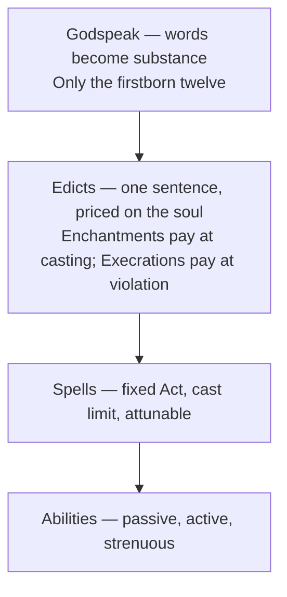
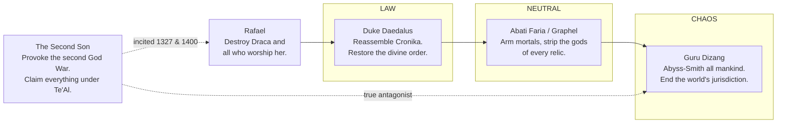

# Asphodia — A Reading

_Notes from a close read of the Wilt core rulebook, the Asphodia module, the cosmology, the timeline, the locale gazetteer, the pantheon, and all twenty player characters, living and shelved._

I read the rules first, then the world, then the history, then the people — in the order you asked for, which turned out to be the right order, because each layer re-reads the one before it. I want to say up front that this is a genuinely accomplished piece of work, and that most of what follows is the kind of criticism you can only level at something that's already coherent enough to have load-bearing walls. There are real flaws. They're mostly flaws of _incompleteness_ and _unexploited structure_, not of confusion. The thing has a spine.

---

# PART I — THE ENGINE

## 1. What Wilt kept, and what it threw away

Wilt is Blades in the Dark's resolution core with almost all of Blades' _structure_ deleted. It keeps the d6 pool read-highest, the 1-3 / 4-5 / 6 ladder, position-and-effect (as Peril & Payoff), clocks (as Stopwatches), pushing, devil's bargains (as Gambits), resistance rolls, and the constitutional rule that the GM never rolls.

What it drops is the entire scaffolding: the score, the engagement roll, downtime, flashbacks, the crew sheet, load, gear, faction clocks. For eight sections, Wilt is a physics engine with no game on top of it. It can tell you what happens when a character tries something. It cannot tell you what a session is shaped like.

I'll come back to this, because Section 9 — Quests — is the answer, and it's a much bigger deal than its placement suggests.

The changes Wilt _does_ make to the inherited parts are more interesting than the omissions:

- **Blades' stress is one track. Wilt's is two.** Flesh♠ and Soul♣, and the setting's Solar/Lunar dualism is imported directly onto the character sheet.
- **Blades' harm is permanent and accumulates until you retire.** Wilt's strain damage _reverses_ when strain drops below its threshold. That is a philosophical break, not a tweak. Blades is a game about accruing irreversible scars until the character can't continue. Wilt is a game about oscillation — you can come back from the edge. That's a JRPG healing economy grafted onto a PbtA attrition frame, and it changes what the game is _about_ more than any other single decision in the book.
- **Blades' resistance reduces or avoids.** Wilt's **always works**. That's a large generosity, and it shifts lethality from the moment to the arc: you never die from one bad call, you die from four hours of never being able to rest.
- **Blades has no harm-only death spiral.** Wilt has one — damage past the Major slot kills.

The net effect is a system that is _kinder per roll and crueler per session_ than its parent. That is exactly the right direction for a Souls-inflected game and I suspect it was arrived at by feel rather than by argument.

## 2. The twelve Acts — a lattice with an unused axis

The Act grid is 4 Traits × 3 Acts, and the three Acts in each Trait share a **Quality** — Direct, Still, Agile.

||Direct|Still|Agile|
|---|---|---|---|
|**Physical**|Force|Endure|Maneuver|
|**Mental**|Hunt|Reason|Tinker|
|**Spiritual**|Ruin|Form|Alter|
|**Social**|Sway|Command|Perform|

This is a good lattice. Force / Hunt / Ruin / Sway as "the same verb in four registers" is legible at the table in a way that a flat list of twelve wouldn't be. A player who knows they're a Direct character knows how they solve problems regardless of domain.

**And the Quality column does absolutely nothing.** Nothing in the rules keys off it. It's the single largest piece of unexploited structure in Wilt, and it's sitting right there in the middle of the most-used table in the book. Some things it could carry, in ascending order of invasiveness:

- Statuses that lock a _column_ rather than a Trait ("you cannot act Directly").
- Abilities that read across a column ("+1♦ to all Still Acts under moonlight") — which would let you build a character around a _temperament_ rather than a _domain_, which is more interesting than what the archetypes currently offer.
- A substitution rule: in a pinch you may attempt an Act with a same-Quality Act from an adjacent Trait at reduced Payoff. That would make the grid a navigable space instead of a filing system.

I'd take the first one for free; it's nearly zero cost and it makes statuses more interesting immediately.

## 3. The archetype wheel — the best thing in the book

There are thirteen classes and six real archetypes (plus Everyman). Each archetype spans four classes, overlapping its neighbours by two. Laid out in a ring, the classes come out in perfect order:

```
Drifter · Hunter | Knight · Inquisitor | Cleric · Monk | Sage · Magus | Heretic · Lunatic | Wurdulac · Changeling | (wrap)
```

Twelve classes, six archetypes, each spanning two adjacent pairs. It closes cleanly. That alone is nice.

But here is the thing I think you may not have noticed:

**The six archetypes' Strengths partition all twelve Acts exactly once each.**

|Archetype|Strengths|Trait(s)|
|---|---|---|
|Warrior|Force, Endure|Physical|
|Zealot|Command, Perform|Social|
|Arcanist|Form, Alter|Spiritual|
|Scholar|Reason, Tinker|Mental|
|Occultist|Ruin, Sway|Spiritual + Social|
|Survivor|Maneuver, Hunt|Physical + Mental|

Twelve Acts, six pairs, no repeats, no gaps. That's not an accident of drafting — but the _interesting_ part is that it **cannot** be done without two archetypes straddling Trait boundaries, because each Trait has three Acts and three is odd. Two archetypes are structurally forced to cross.

And which two cross is a choice, and you chose the two that make the most thematic sense in the entire set. **Survivor** takes Physical/Agile + Mental/Direct — the body that evades and the mind that tracks. That is precisely a survivor. **Occultist** takes Spiritual/Direct + Social/Direct — annihilation and seduction, the two ways of reaching into another person without permission. That is precisely an occultist. The mathematics forced a compromise and the compromise landed on the two most evocative pairings available.

The quirks confirm the design is deliberate. Opposite archetypes on the wheel receive **inverse** quirks:

- **Warrior ↔ Scholar** — _substitution_. Warrior resists Mental/Spiritual with Physical/Social; Scholar resists Physical/Social with Spiritual/Mental.
- **Zealot ↔ Occultist** — _transmutation_. Lunar→Solar; Solar→Lunar.
- **Arcanist ↔ Survivor** — _restoration_. Critical resistance recovers all strain, on opposite halves of the sheet.

Three mirrored pairs, one per axis. This is the tightest piece of engineering in the document and I don't think the rulebook ever says it out loud. It should. Not for the players — for you, so you don't accidentally break it when you add the seventh archetype.

### The Everyman is either brilliant or a bug

The Everyman "encompasses every class." Section 7 prices abilities at **1♥ within your archetype, 2♥ outside**. Therefore the Everyman buys _every ability in the game at half price_, effectively doubling their ability budget, in exchange for two starting Act ranks and a quirk.

If that's intentional, it is the best-designed class in the book: the ordinary person has no gift and infinite range. It is the Dragon Quest silent hero. It is the Chosen Undead who was nobody. It says something true — that being unspecialised is a kind of freedom that costs you a floor.

If it's _not_ intentional, you should make it intentional, because it's better than any alternative reading.

Either way it needs one line of text, because right now a rules-lawyer finds it in ten minutes and a normal player never finds it at all.

## 4. Flesh, Soul, and the six slots

This is the mechanical centrepiece and I want to lay out why, because I think it's better than the book knows.

Two strain bars, 0–10 each. Thresholds fire at 5, 8, and 10, **every time you land on them**. So:

- Strain 5, 6, 7 → three separate instances of minor damage
- Strain 8, 9 → two instances of moderate
- Strain 10 → one major

There are exactly three minor slots, two moderate, one major.

**A single bar taken to maximum fills your entire damage track exactly.** Six sources, six slots. Not one over, not one under. That is a beautiful number and it means a maxed bar leaves a character standing at precisely zero margin: one more scratch of any kind and they escalate past Major and die.

And there are **two** bars feeding **one** track. They compete. If Flesh sits at 7 (three minors) and Soul reaches 5 (a fourth minor), the minor slots are full and the fourth escalates to moderate. The two halves of a person crowd each other out of the same body.

Then statuses go in the same slots. And consequence damage goes in the same slots. Every bad thing that can happen to a character — exertion, injury, curse, despair, poison, humiliation — competes for the same six pieces of real estate. That is thematically airtight. A person has one surface to be written on.

The routing is also good and I want to flag it specifically:

- Physical **and Social** consequences strain **Flesh**.
- Mental **and Spiritual** consequences strain **Soul**.

Social hurts the body. Humiliation is somatic. Mental hurts the soul — _thinking too hard wounds your spirit_, which is a Bloodborne thesis rendered as a routing rule. The pairing is Outer/Inner: the world you are _in_ versus the world you _are_. And the Warrior/Scholar quirks are exactly permission to solve the inner with the outer and vice versa.

### The problem

You cannot track this at the table.

To resolve strain damage you must know _which_ threshold each written damage came from (so you know when to clear it), _which bar_ wrote it (both bars write into the same slots), and whether a given slot holds strain damage (reversible), consequence damage (not), or a status (with a duration counter). And when a slot escalates upward, its origin has to travel with it.

In play this runs on GM memory and goodwill. It works because you're a good GM and your table trusts you. It will not survive being handed to someone else.

**The single highest-value thing you could produce for Wilt right now is not a rule. It's a character sheet.** Six slots drawn as physical boxes, each with a small origin marker (♠/♣ for strain-from-bar, a dot for consequence, a number for status duration), and the two bars drawn adjacent with the thresholds printed at 5/8/10. The bookkeeping becomes visual and the whole problem evaporates. The mechanic is good enough to deserve the furniture.

## 5. Resistance rewards breadth, and that's a real statement

> _Roll the Trait matching the consequence's type, counting one die per non-zero Act in that Trait._

Your durability is your **breadth**, not your depth. A character with Force 5 and nothing else Physical resists exactly as badly as one with Force 1. To be hard to kill you must be _broad_.

This is in direct, productive tension with the XP economy, which hands you Trait XP that you spend by ranking up _one_ Act. Six marks of Physical XP can go entirely into Force. The system lets you build a devastating, brittle specialist and then punishes you for it structurally rather than by fiat. That's excellent design — the punishment is legible, avoidable, and never feels like the GM's opinion.

The disadvantage rule sharpens it further. With no rank you roll 2d6 and read the lowest:

||Failure|Partial|Full success|Critical|
|---|---|---|---|---|
|**2d6 disadvantage**|75%|22.2%|—|2.8%|
|**1d6**|50%|33.3%|16.7%|—|
|**2d6**|25%|44.4%|27.8%|2.8%|
|**3d6**|12.5%|45.4%|34.7%|7.4%|
|**4d6**|6.3%|42.0%|38.6%|13.2%|
|**5d6**|3.1%|37.1%|40.2%|19.6%|

Look at the disadvantage row. **Reading the lowest of two dice, a 6 can only appear if both dice are 6 — which is a critical.** A character acting outside their competence _cannot ever plainly succeed_. They fail, they scrape, or they get a miracle. There is no such thing as competent-enough for someone with no rank.

I'd be surprised if that were designed. It is perfect. It is the exact emotional texture of being out of your depth, and it's the thing that makes the Drifter's **Even the Odds** — 75% failure at Grave Peril, purchased for a guaranteed Miraculous Payoff — one of the best-feeling abilities I've read in a homebrew. That ability is a Souls boss attempt in a single line.

## 6. Notes from the margins of the engine

**Pushing costs 1 strain on _each_ bar.** Effort is always holistic; you cannot exert yourself in only one direction. Small rule, correct instinct.

**Crits belong to individuals.** Unite explicitly cannot produce criticals. Vampyr Moondance explicitly cannot produce criticals. But _Help_ — which gives a die to a single roller — can. The pattern: **pooled or borrowed power cannot transcend; only a protagonist can.** I don't think that's stated anywhere and it's a real design philosophy. It's worth naming, because it tells you how to price every future ability.

**Trait XP comes from Grave Peril, per roll. Character XP comes from end-of-session narrative conditions.** So capability grows from _danger_ and identity grows from _story_. That split is exactly right for the genre — you level by going somewhere that could kill you — but it's fast. Six grave-peril Physical rolls is a rank. You already noticed the exploit and patched it for Sequences (2 XP total, not per roll); the same cap should probably exist for any chain of grave rolls in a single scene.

**Recuperation is deliberately a bad deal** — expected recovery ≈1.4 per bar against a push cost of 1 per bar and resistance costs of 1–3. Good. It should feel like a desperate measure.

**The rest ladder — Respite / Relief / Repose / Relaxation** — is well-named and well-shaped, but note that **Relaxation is the only tier that moves damage down**, and it requires "several days of peace." Your campaign has never once offered several days of peace. Mechanically, your world does not permit healing. I'll come back to that in the literary section, because I don't think it's a bug.

**Two contradictions to fix in a single editing pass:**

1. _"The GM and NPCs never roll"_ (§1) versus the Elements rules, where the GM rolls a die into the pool for weaknesses. Reword to "an extra die is added to your pool" and the constitutional rule survives intact.
2. _"The GM may never directly touch a player's strain — only through status ailments"_ (§5) versus Wither and Despair, which do exactly that. The carve-out is already written; the sentence just needs to acknowledge it rather than say "never."

**"Impossible actions can only be attempted once"** — once by whom, and for how long? Once per character per situation? Once ever, by anyone? In a world with three chronopaths and a save-point system, "once ever" has teeth you might want.

## 7. Elements, statuses, and the Solar/Lunar spine

Nine elements. Four Solar, four Lunar, one neither.

|Solar|Lunar|The opposition is…|
|---|---|---|
|Agni (Infernal — burns unquenchably)|Ventus (Celestial — spectral movement)|substance vs. absence|
|Aqua (Glacial — freezes unmeltably)|Volta (Thundergale — lightning movement)|stasis vs. motion|
|Flora (Faunal — bends souls and wills)|Terra (Centripetal — bends gravity)|soul vs. mass|
|Sacrum (Radiant — vile wounds never close)|Profanum (Blasphemous — wounds grow)|judgement vs. corruption|
|**Arcanum** (Lifeblood — cannot be resisted or blocked)|||

These are not the obvious pairings and they're better for it. Fire's opposite is not water; it's _wind_. Water's opposite is _lightning_. Once you see the Apex forms the logic snaps into place — the axis is **permanence versus motion**, not hot versus cold. Agni is a presence that will not leave; Ventus is a passage that was never there. Aqua is a stillness that will not break; Volta is a speed that cannot be caught.

Flora ↔ Terra is the sharpest one: soul against matter. And Asphea's husband _is_ Matter. Terra is the husband's element and Flora is the wife's, and the wife's Apex form — Faunal, "the bending of souls and wills" — is the power to make things want. That is a very good piece of cosmological rhyme whether or not you built it on purpose.

Only **one of the four pairs is moral** (Sacrum/Profanum). Three of four are morally neutral. **The mechanics say Solar and Lunar are two equal columns.** Every piece of _narrative_ framing says otherwise — the Heretic, the Lunatic, Abyss Mastery as "a heretical art," the gods barring Execration-casters from every afterlife.

That contradiction is productive, not broken. It is exactly the tension Castlevania and Souls live in: the Dark Soul is not evil, it is merely _other_; Alucard is the hero. But the game should know it's doing it. Right now the mechanics are quietly more enlightened than the world, and the world doesn't seem aware that it's being judged by its own physics.

**Nine elements and nine statuses, unmapped.** That symmetry is too clean to be coincidence and too unused to be finished. I'm not going to tell you what the mapping should be — but I'd note that the statuses fall into three natural groups, and so do the elements:

- **Denials** (Undo, Stun, Blight, Hex, Stress) — five
- **Accruals** (Bleed, Wither, Despair) — three
- **Nullification** (Fog) — one

**Fog is not the same size as the others.** All Act ranks to 0 means every roll for its duration is 75% failure with no possibility of ordinary success. Fog is functionally Major damage sitting in a list next to "can't cast spells." It either wants a longer name and a rarer source, or the other eight want a friend.

The **Weak / Strong / Null / Drain / Repel** affinity set is lifted wholesale from Shin Megami Tensei, and it works, but note that it introduces the only _pre-roll knowledge check_ in the game — you need to know a target's affinity to exploit it. Celestial Sight (Sage) reads it. That single ability is therefore load-bearing for an entire subsystem, and a party without a Sage plays a different game than one with.

## 8. The abilities

Sixty-five abilities across thirteen classes, and their **mechanical specificity varies enormously**. Compare:

> **Weapons Master** — +1♦ when attacking with a weapon you hold.

> **Fate Weaver** — Conduct a reading that bends fortune across a scene — aiding allies, hindering foes, stirring the world itself — its shape set by your interpretation and how firmly the threads answer you.

Both cost 1♥ in-archetype. One is a rounding error and one is a blank cheque. With a hard cap of 12 abilities and an ♥ economy that runs at eight character XP per heart, a wasted pick is expensive.

I don't think the fix is to mechanise Fate Weaver — the evocative ones are the good ones, and Blades gets away with the same thing. The fix is at the _cheap_ end. Three of the five Commoner abilities key off subsystems the core rulebook explicitly disclaims:

> _"There are also no mechanical rulings for travel, trading, or gear."_

**Mercantile Spirit** (+1♦ when trading), **Joy of Creation** (+1♦ when crafting), and much of **Take Me Homeless** are bonuses to activities Wilt has declared out of scope. The Commoner is thematically the most interesting class in the book — the class of nobodies — and it's the one most damaged by the core rules' minimalism. Either give trade and craft a light Peril/Payoff footing, or rewrite those three into the frame the game actually runs on.

**A Sucker's Prayer** is the opposite problem. Free, unlimited respec at any place of faith, in a game with elemental weaknesses. In a party that knows what it's about to fight, that is the strongest ability in the book by a wide margin. That's a Dark Souls Fire Keeper and a Dragon Quest Dharma Temple at once, which is charming, but it wants a cost — a stopwatch, a strain price, a once-per-arc limit, something.

A few I want to praise specifically, because they're doing more work than their word count suggests:

- **Divine Favour** (Inquisitor: summon your Empyrean) and **Altered Beast** (Lunatic: become your Abyssal) are the Solar/Lunar mirror rendered at the ability layer. One _summons_ the self you admire; the other _becomes_ the self you flee. That the summoned one fights beside you and the become one costs you your reason is precisely correct.
- **Guiding Light** (Inquisitor, heals self) versus **Healing Prayer** (Cleric, heals other) — the Inquisitor is armoured in his own righteousness; the Cleric spends himself on someone else. Two abilities, one whole theology of two classes.
- **Godsmith** (seal a soul into an item) is simultaneously a player ability, the mechanism behind Guru Dizang, the premise of the Idolon Arena, the reason Brant carries Megido, and how Oleander turns bones into equipment. That is deep integration — a single ability that the setting is _built out of_. More abilities should reach that far.
- **Crown of Horns** (sever your own limb for a surge of power) rhymes with Raul, whose entire existence is scattered limbs and returning power. Whether deliberate or not, a player taking that ability is playing a small version of the setting's saddest man.
- **Even the Odds**, discussed above. Keep it exactly as written.
- **Death Penalty** — revive once per session, frail until you reach a place of faith. That's the bonfire loop, and it interacts nicely with §5's rule that revival costs a level. Good tension: the free revival is the one that "may come at a steeper cost than desired."

**Register drift** is worth noting as a style question rather than a flaw. _History in the Making_, _Radiant Presence_, _Penance_, _Miraculum_ sit in one voice. _To Hell in a Hand-basket_, _Hell's Kitchen_, _Stomach of Silicon_, _Take Me Homeless_, _A Sucker's Prayer_ sit in another — wry, idiomatic, modern. Both registers exist in your sources (Souls item descriptions are frequently dry jokes; Castlevania is unembarrassed about _Item Crash_). But right now the wry voice clusters almost entirely in the Lunatic and the Commoner, which means tone is tracking class. That might be deliberate characterisation, in which case lean harder; if it isn't, it reads as two writers.

## 9. Heritages — where the theology becomes mechanics

This is where Asphodia and Wilt fuse best, and it's worth going one at a time.

**Gail** — children of Galatus, god of camaraderie and hope. _Take minor damage to re-roll your entire pool. Upon dying, you get one final action with Miraculous odds. Waste no Strain when Uniting._ Humans are mechanically defined by **refusing to accept a result**, **acting once more after death**, and **costless cooperation**. Their god is asleep in a mountain, presumed dead by the world. The species whose superpower is _one more try and one last word_ worships a god of hope who nobody knows is still alive. If you had designed that on purpose it would be the best thing in the book; I suspect you designed half of it and the world supplied the rest.

**Aél** — children of Crucito, 240-year lifespan. _Extra die on Attunement and Resisting; extra Trait XP once per session per Trait._ The **advancement race**. Long-lived people accumulate — the mechanic is literally "you learn faster and you endure better." And their motto is _Audio, Video, Disco_ — I hear, I see, I learn. Perfect fit.

**Vampyr** — children of Temeran, do not perish with age. _Moondance: in direct moonlight, if free of strain, your pool equals your highest Act rank for any Act you have a rank in. No crits. Disadvantage in sunlight._ This is the most sophisticated heritage in the book. Vampyr are **front-loaded and immaculate**: devastating while unblemished, and the instant they take a single point of strain the entire power collapses to normal. Aristocratic perfection that cannot survive being touched. And _no crits_ — undeath is reliable but cannot exceed itself. That is a whole vampire novel expressed as three clauses.

**Undine** — children of Adamaal, god of war. **60-year lifespan, the shortest in the game.** The war god's people die youngest. Nobody says this anywhere and it's the best single detail in the heritage list.

**Lazi** — children of Maluma, survival and adaptation. _No damage from fire or thunder._ Note that's one Solar element (Agni) and one Lunar (Volta) — Maluma's people are immune to a piece of each column, which is exactly what a god of adaptation would grant. And _Nil Desperandum_: "never despair." **Despair is a status in this game.** Whether that's a joke or an oversight, it's delightful.

**Fae** — children of Abara, love and deceit. _Ad Astra_: fly, and shrink to a tenth of your height. Alter & Perform. Small, beautiful, unreliable. Correct.

Every heritage's mechanic is its patron god's theology restated in dice. That is the strongest single alignment between the module and the engine, and it's the model the rest of the game should be measured against.

**Five heritages exist in play and not in the rules**: Construct (Clover is one), Biota, Fiend, Exanimate, God — all appear in Populace fields or on character sheets. Exanimate in particular has a full Phenomena entry, a mechanism, two subtypes (Calx, Necrophage), and an active player character (Maxill), and no heritage write-up. That's the most conspicuous gap in the module.

---

# PART II — THE WORLD

## 10. Genesis, and the best first sentence you could have written

> _In the beginning, there was nothing but Asphea. Asphea grew lonely, and she created herself a husband — matter._

Everything in the cosmology descends from this and it's a genuinely severe premise. The universe exists because God was **lonely** and built a spouse out of _stuff_. Matter is not co-eternal, not a rival principle, not a fall. It is a **coping mechanism**. Every material thing — the Fleeting Plane, bodies, the world, you — is downstream of one being's inability to be alone.

And then: **the Claimant is a child of Matter, not of Asphea.** Death belongs to the husband. She made life; he made ending. The marriage produces a world that dies.

That's a complete and internally consistent metaphysics in three sentences, and it sets up the whole pantheon as a **family problem**. The twelve gods are the children of a loneliness and a substance, and their first act as a family was a war over property.

## 11. Asphodel

The world is called Asphodia. The mother is Asphea. There is a Temple of Asphodel and an Asphodel's Arena. The map is a **flower with four petals**.

Asphodel is the flower of the Greek underworld. The Asphodel Meadows is where the _ordinary_ dead go — not punished, not rewarded, simply there. Neutral ground for people who were neither notable enough for Elysium nor bad enough for Tartarus.

So: **the world is named after the neutral afterlife, and shaped like the flower that grows there.**

Which means the Fleeting Plane _is_ the Asphodel Meadows. Idolons "float in and out" of it. The gods reach in and pick souls out of it. Souls no god wants are left to wander. Every living person in Asphodia is already a shade in a field of the undistinguished dead, waiting to see whether anyone claims them.

I don't know how deliberately you built this, but it is the strongest thematic engine you have and it recontextualises the entire setting. **Living in Asphodia is being in the waiting room, and not knowing it.**

## 12. The God War as characterisation-by-property

The smartest structural move in the cosmology is that you never describe the gods' personalities directly. You describe **what each of them won**, and the personality is inferred. This is worldbuilding by outcome and it's far more efficient than adjectives.

- **Galatus**, god of camaraderie, **won the most**. The most likeable god took the biggest prize. That is darkly funny and it is also a real observation about how the world works.
- **Adamaal**, war and hunting, took two kingdoms and **the entire ocean**. War claims the unbounded thing.
- **Cronika**, discipline and time, won an island and a **shared** kingdom. Discipline is small and cooperative.
- **Maluma**, survival, took **the battlefield itself** plus a harsh archipelago. Survival takes the wasteland. Nobody else wanted it.
- **Magna**, magic and entertainment, didn't win land — she **built** her kingdom with magic. She made her territory rather than taking it.
- **Crucito**, craftsmanship and solitude, won an island and the frozen north **and gave it away** to his children. The craftsman makes and hands over.
- **Abara**, love and deceit, **threw the war**, taking two small islands. Of course she did.
- **Draca**, motherhood and destruction, won two mountains and **gave one to her son**. Motherhood enacted in the moment of victory.
- **Lutrios** didn't fight at all. He **rooted himself and made flora**. The one who abstained is the one who created.
- **Temeran lost entirely.** _"It is said that his territory is everywhere where the sun doesn't fall."_

That last line is the best sentence in the corpus and I want to be specific about why.

**Losing the war made him ubiquitous.** He has no land, and is therefore _inside_ all land. Every other god is bounded by a border on your map. Temeran is bounded by nothing because he owns an absence. It explains why Vampyr are found in every population list, why Te'Al is "the shadows of the Fleeting Plane," why the Second Son can hunt anywhere, and — critically — why the coming darkness in your endgame is a **spreading** rather than an **invasion**. There is nowhere for it to invade _from_. It is already distributed.

It also means the eleven who won are the ones with something to lose.

## 13. The afterlives

The afterlife table is, I think, the single best artefact in the vault. Nine destinations for twelve gods, and taken together they form a complete taxonomy of what a person might actually want after death:

|Afterlife|What it offers|What it really is|
|---|---|---|
|**Ad'Al** — coliseum, beasts, booze, battle|eternal contest|Valhalla|
|**Fid'Al** — the garden, virtue rewarded|eternal reward|Elysium|
|**Ma'Al** — the theatre, act or watch lifetimes of plays|eternal art|the most generous heaven here|
|**Ga'Al** — the skies, commune and observe the living|eternal company|watching from above|
|**Cru'Al** — eternal solitude, to dedicate oneself to creation|eternal work|presented as reward; reads as hell|
|**Te'Al** — the shadows, join Temeran in observing|eternal witness|watching from below|
|**Lu'Al** — returned to Papillopolis, united with the threads|dissolution|ego death|
|**Dra'Al** — reborn as a dragon|transformation||
|**Mal'Al** — reincarnated, take the world on once more|repetition||

Three observations.

**Ga'Al and Te'Al are the same activity.** Galatus's heaven and Temeran's heaven are both _watching the living_, from above and below. The most amiable god and the most duplicitous one both settle on the same eternity: looking at us. That's a marvellous rhyme and it makes the two poles of your theology far less oppositional than the Solar/Lunar framing suggests.

**Cru'Al is a horror presented as a prize.** "Eternal solitude, to let all dedicate themselves to creation." The craftsman's heaven is being alone forever with your work. Crucito is the god who won territory and _gave it away_, who lives alone in a tower in the middle of a sea, and whose paradise is isolation. There's a whole meditation on artistic vocation sitting in that one row and it's four words long.

**And then this:**

> _Whether the gods allow it in or not can change, based on the gods' whims._

**Salvation is revocable.** You can be evicted from heaven. Not for sin — for _whim_.

That single clause converts the entire theology into a protection racket, and it is the load-bearing justification for every antagonist in your endgame. It makes Guru Dizang correct. It makes Daedalus's restoration project reasonable. It makes Abati Faria's plan to disarm the gods **not villainous at all**. You have written a cosmology that the setting itself cannot morally defend, and I think that's on purpose, and I think it's the best decision in the worldbuilding.

## 14. Idolon, Empyrean, Abyssal

> _Empyreans are the manifestations of what a soul **believes** to be its best, most virtuous qualities; meanwhile Abyssals are the traits and qualities a soul runs and hides from the most._

The word doing the work is _believes_.

An Empyrean is not what you actually are at your best. It is **what you think your best is**. A righteous monster generates a monstrous Empyrean and considers it holy. Meanwhile the Abyssal is what you _flee_, which may be entirely innocuous — a coward's Abyssal might be gentle; a cruel man's Abyssal might be his tenderness.

This undercuts the Solar/Lunar moral hierarchy at the metaphysical root. **Your light is your vanity. Your dark is your honesty.** And the setting proves it in its very first example:

**Aramis is Cronika's Empyrean, and Aramis is a dragon.** The goddess of discipline died attacking her dragon sister, and her soul's image of its own best self is _a dragon_. Either she wanted to be Draca, or her idea of virtue was the thing she killed for. Both readings are devastating and the text lets you have either.

And then Draca **rejected** the beast — refused her dead sister's self-image as a child. So Aramis retreated to Kronitia, met Rafael "right after he had Execrated his brother," and "Rafael tamed the beast with mutual grief and love."

A rejected Empyrean and a man who has just damned himself, bonding over grief. That's an extraordinary meeting and it's told in two sentences.

**The Keeper** — the Claimant's Empyrean — "looks for souls whose demise was caused by misplaced wrath, and dons their faces to avenge them." Death's idea of its own best self is a **vigilante**. Death thinks it's the good guy. Meanwhile Death's _child_, Morticia, imprisons vagrant Idolons and drains them forever. The family of Death contains a hero and a warden, and the hero is the self-image.

**The Second Son** is Temeran's Abyssal — the avatar of a god's pain, "often hailed as the first Abyssal," first practitioner of Wurdulac arts. He stepped into sunlight and turned to ash, and **his ashes are Asphodel's Arena, the desert where the gods made war.**

So: the God War was fought on the ashes of a god's disowned suffering. The battlefield is made of the thing they would not look at. That is the best worldbuilding image in the vault and it is the thesis of the setting in one fact.

## 15. The six planes, and where the shadow lives

|Plane|What it is|
|---|---|
|**Sempiternal**|contains all others; gods, afterlives, the mother|
|**Fleeting**|the world; things that pass|
|**Umbral**|a fragment of the Sempiternal, containing reflections of all Abyssals|
|**Solar**|exists _inside_ every Idolon, separate yet connected to all other Solar Planes|
|**Elemental**|concentrated elemental energy, growing without rhyme, crashing into itself|
|**Undone**|severed from time; things and souls with no place left in it|

The Solar and Umbral definitions form an inversion I think is genuinely profound, whether or not it was designed:

**Your virtues are private and secretly universal. Your shadows are public and held in common.**

The Solar Plane is _inside_ you, "separate of the rest yet connected to all other Solar Planes" — which is a textbook collective unconscious. The Umbral Plane is _outside_, a shared repository of everyone's Abyssals, and you can **physically walk into it** (the Lunatic's _To Hell in a Hand-basket_). One's light is interior and unknowingly shared. One's shadow is exterior and pooled with everybody else's, in a place that is a _fragment of the divine_.

That is Jung rendered as real estate, and it's better than Jung, because the Umbral Plane being a piece of the Sempiternal means the gods' own domain is partly constructed out of everyone's refuse.

**The Elemental Plane is inert.** It's the only one of six with no character, no location, no event, and no story attached. Everything else in the vault has hooks running out of it. This one has a description and nothing else. That's your most obvious blank canvas.

**The Undone Plane** is doing quiet, excellent work. Kronitia lives there. Clover's status is "Undone." Perialus at Mansfield was "undone." The World Chasm is a **one-way gate** to it, made by Adamaal "when the people of Wonderlay wouldn't stop trying to reach Undine kingdoms underneath it."

A god built a permanent time-exile to enforce a border, and it's mentioned in passing, in a locale entry, without comment. That casualness is exactly right — it's how a world tells you what it considers normal.

## 16. Magic as a hierarchy of who may speak

The magic system is, underneath, a hierarchy of **linguistic permission**:



Magic is language, and power is _who is allowed to say things_. This is an old idea (true names, kabbalah, the Word) and you execute it with unusual restraint — the ladder is four rungs and nobody explains it at length.

**Edicts are the best magic system idea in the vault.** Three constraints do all the work:

1. Never longer than one sentence.
2. Self-governing — the rules of an edict enforce themselves.
3. Enchantments pay their price at casting; **Execrations pay theirs at violation.**

That third one is superb. An Execration is a _debt with a trigger_. And the gods bar Execration-casters from every afterlife, and Execration-casters cannot be revived.

Which means: **Rafael, having cast an Execration on his brother, has already permanently damned himself.** No afterlife will take him. He cannot be resurrected. He did this in 1400 and has spent forty-one years pursuing a revenge he can never survive to enjoy. He is not a man risking everything; he is a man who **already spent it**, in the first hour, and has been running on the balance ever since.

That is tragedy in the technical sense — a fate sealed by the protagonist's own decisive act — and it's fully mechanised. Nothing about it requires GM fiat.

And the counterplay to the same rule is Raul's entire existence:

> _Raul's power and memories are to be sealed within his limbs, scattered across time and space._

> _By regaining his limbs, Raul would contradict a declaration of his execration, and its surrounding conditions would break as well._

**Raul is a man reassembling himself in order to break a sentence.** His body is a grammatical counterargument. He is Osiris, but Osiris with a lawyer's motive: he's not seeking wholeness for its own sake, he's seeking to make a declarative statement false.

And note what the split between the brothers actually is. In 1400, "Rafael wanting Draca and her worshipers dead, Raul wanting to get to the bottom of it all first." The split is **epistemological**: one wants to act, one wants to _know_. And the one who wanted to know was punished by having his knowledge **distributed across geography**. His memories are in his limbs. The man who wanted understanding must now physically travel in order to think.

That is one of the best character premises I have encountered in a homebrew setting, and it's also a perfect adventure engine: go here, recover a piece, remember a thing. It's Metroidvania as a _character_, not as a level design.

## 17. Places

Some of the locale entries are doing more than they announce.

**Mansfield Manor** is the setting's fascist state and it's an unusually good one, because the _architecture is the argument_. A colossal human tower built atop a slaughtered Cyclops stronghold, "their one-eyed heads still impaled on titanic lances around the walls, some gouged, some arrow-pricked from target practice." Magic prohibited. Magical guests fitted with power dampeners and confined to the **entertainment districts** — markets, pubs, casinos, theatre, an arena.

A magic ghetto that is also a casino. The message is: _you may exist here as amusement._ That's sharper than most fantasy-bigotry analogues manage, because it's not hatred, it's **licensing**. And the motto — "By human hand, our fate is sealed… For only man shall ever stand" — is a _fatalism_, not a triumph. They're not proud, they're afraid.

And it's set directly against **Rubimel**, which lists Mansfield in its Opposition field: a swamp town of witches, healers and voodoo folk, most of them half-dead and kept alive by each other's necromancy, where "time outside feels as if it has stopped" and Sage Morrigan runs a campsite with drums, woodwinds, and teenagers arm-wrestling.

Tower against swamp. Purity against mutual aid. Target practice against a drum circle.

**Rubimel burned in 1413. Mansfield is still standing.** That is the world the 1441 party woke up in and I don't think the campaign has fully reckoned with it yet.

**Drakengard** — "The mountain range is in fact a colossal dragon — Draca's Empyrean. Its head is overlooking the World Chasm and its tail is the rocks on which Lanaganne is built. The mountains' quakes reflect changes in Draca's mood."

**Geology as emotion.** Every earthquake in the Eastern Petal is a god grieving her sister. The people of Melumdam live "in the literal shadows of the Drakengard mountains" — they live in the shade of a goddess's self-image, and the ground shakes when she remembers.

**Castle Kingdom Magnolia** is the most fully realised location in the vault and it earns it. Five factions with mapped influence, tensions and peace treaties; a physical anti-murder field that exists "to preserve the sanctity of magic and order, and **not out of concern for human life**"; Wardens who investigate only _mundane_ crime and are unwelcome everywhere. It's a city where magic is safe and people are not, which is a genuinely novel inversion of the usual fantasy metropolis.

The Idolon Arena — champions fighting with their externalised souls, sponsored by the aristocratic faction, "presided over indiscriminately" — is the setting's clearest statement of what the elite consider entertainment: watching people's private selves fight to the death.

**Infernait** is a prison island that is a volcano, with the Arbiter — son of Crucito and Draca, creator of Drakenblight — at the bottom of the throat. So Infernait is not a prison. It is a **reliquary built around a divine family's shame**, staffed by Aél, and the inmates are incidental. The party broke a man out of it and the man they freed was granted eternal life by the Second Son.

**Papillopolis** is the setting's most important loss and the entry is beautiful:

> _Those who merely venture in return unharmed, but those who speak to the god himself are seldom heard from again. Thus, in 1400, a myth arose that they would be slain, but the real reason is that they reach enlightenment, and choose to stay with the first living thing forever._

**Enlightenment in Asphodia is indistinguishable from disappearance.** The people who let go stop being characters. That is the setting's honest, bleak claim about what it costs to be at peace here — and the place where peace was available **burned to the ground**, and its last piece now lives inside a man who was punished with power he cannot control.

**Heathen Homestead** is the biggest underwritten thing in the vault, and it's underwritten in the place where it matters most. It is "a place that bows to no god" — Dvorakia at its centre, the Shrieking Titan somewhere in it, the whole region an empty file.

But here is the implication your own rules generate: **the afterlives are gated by divine permission.** Souls no god claims wander the Sempiternal Plane, and Exanimation happens to "a stray Idolon mustering enough willpower to force itself back in its corpse — after, say, having been locked out of afterlives."

So a godless nation is a **demographic pipeline into undeath**. Every Dvorakian who dies is unclaimed by definition. Heathen Homestead is a country of future ghosts, and Maxill Mandable — its greatest emperor, dead in 1403, walking in 1441 as a Calx — is not an anomaly. **He is what Dvorakians become.** He's the first one important enough for someone to bother collecting.

Nothing in the vault says this. It follows entirely from rules you already wrote, and that's the mark of a cosmology that works: it generates horror by implication rather than by assertion.

---

# PART III — HISTORY AND PEOPLE

## 18. The shape of the history

The timeline has an unusual structure and I want to name it before going into the people.

**1400 is the fracture.** Cronika attacks Draca over a theological quarrel she was _incited into_ by the Second Son, and dies. Her spirit disperses into her bloodline. The Claimant comes to collect. Kronitia is destroyed. The brothers duel. Rafael scatters Raul. The myth about Lutrios arises. Six catastrophes in one year, all downstream of one god's temper and one Abyssal's patience.

**1413 is the campaign.** Thirty-odd events, most of them the party's doing.

**1414–1440 is a silence.** Two entries in twenty-eight years: Brant seals Megido (1436) and Father Gabriel takes Wassonia (1438). Both are acts of _containment_ by people who then withdraw from the world. The world's response to the party disappearing was to produce two men who sealed something dangerous inside a boundary and went quiet.

**1441 is the reawakening**, and it moves fast.

Then: **"The undone futures, 1441."** Two failed timelines, recorded as history.

This is the single most important structural fact about Asphodia and I'll treat it properly in the literary section, but note what it does to the _document_: your timeline includes events that did not happen, in a section headed by the word "undone," which is also the name of a plane, also the status of a player character, also what happened to High General Perialus. The vault has a vocabulary for erasure and uses it consistently.

## 19. The Tannengards

**Rafael** is Edmond Dantès and I don't think that's arguable. A noble family, an empire destroyed, a decades-long return under a new posture, hypnotism as his signature method, and a machine of revenge that reaches everyone connected to the original wrong. He brainwashed Cornelius to control Galatea _from within_. He bought Asbarnia's souls through a bishop's paintings. He resurrected an emperor to serve him. He hypnotised his way into a throne room. He is not a warlord; he is an **infiltrator**, and every one of his moves is an act of _substitution_ — putting his will inside someone else's institution.

And his war aim is genocide with a coherent motive: destroy Draca, her kingdom, and **all of her worshipers**, to avenge an empire that was destroyed by her hand only in the most indirect sense. Cronika attacked. Draca defended. Rafael's grievance is that his goddess lost a fight she started, and the target he has selected is everyone who prays to the winner.

The thing that makes him tragic rather than merely villainous is the Edict rule: **he damned himself in 1400 and cannot undo it.** No afterlife. No revival. He spent his eternity in the first hour of his grief, and forty-one years later he is still spending an inheritance he no longer has.

**Raul** is his counterargument, and everything about them is inverted. Rafael acts; Raul wants to know. Rafael is whole and hollow; Raul is fragmented and driven. Rafael controls other people's bodies; Raul cannot control his own. "An army of small demons substitutes for muscles everywhere else."

And Raul's 1441 goal — kill his brother to prevent the war — is stated alongside the vault's own honest flag: _"though how, with his soul still hidden, goes unrecorded."_ Good practice. Leave that unresolved rather than papering it.

**Graphel** is the third chronopath and the most important character in the vault, and I'll take him in Part V.

## 20. Duke Daedalus, and the best mythological pun in the setting

Son of Draca and Temeran. First Vampyr, father of all Vampyr. Ruler of Dhidalah. Opposed to Rafael. Wants to find Cronika's three surviving godbloods and **transform them back into Cronika**, restoring the divine status quo.

He is a **restorationist**, which makes him the most unusual antagonist here, because he doesn't want to win — he wants to _undo_. In a world where the ancien régime was a functioning divine order, the conservative position is not obviously wrong. And his method (dissolving three living people back into their ancestor) is monstrous _and_ proportionate, if you accept the premise that a dead goddess is worth more than three men.

He is also **reasonable**. "In case of rejection, he will agree to let them go peacefully and not directly interfere until the remaining two are in his grasp." A villain who takes no for an answer is rare and worth protecting.

Now the name.

**Daedalus built the labyrinth and the wings. His son Icarus flew too near the sun and burned.**

Daedalus's descendants — the Vampyr — **burn in sunlight**. Icarus, for this species, is not a cautionary tale. It's a **heritage trait**.

And his brother, the **Second Son**, "stepped into the sunlight and turned to ash."

Temeran had two sons. One flew into the sun and burned to nothing, and his ashes became the desert where the gods fought their war. One built a labyrinth in a mountain and endures. **The Second Son is Icarus and the Duke is Daedalus**, and their father's whole domain is the place the sun does not reach.

If that was deliberate, it's the finest piece of naming in the vault. If it wasn't, it's the kind of accident that only happens to writers whose instincts are already aligned.

One more thing about Daedalus, and it's a live campaign threat you may not have priced: **he is "attuned to all Vampyr."** That's how he punished Clairmont — by _misleading him_ into burning his own village and himself to death. If the father of the species has a passive line into every one of his children, then Hemos, Caliburn, Lillianele and Lucas are all, in principle, reachable. Daedalus can whisper to three player characters. He has demonstrated, on-screen, that he will use this to make someone commit suicide by arson.

## 21. The party

**Graphel Degrie** — Gail Warrior, Galatean outlaw, sentenced to death for courting the queen, broke out, saved the kingdom, pardoned and exiled. Unwittingly Cronika's godblood. Chronopath. Has run this campaign **three times**.

And: _"looking for the author of his books, Abati Faria."_

And: _"In truth, Abati Faria is the identity donned by Graphel himself, after his second return through time."_

**Graphel is looking for himself.** The books he read as a child were written by the version of him that failed twice. He is searching for his own mentor and the mentor is his own future, and the future is a man whose plan is to arm mortals and strip the gods of every relic.

I'll unpack this in Part V. For now: it's the best structural idea in the whole project.

**Hemos Solare** — Vampyr, heir to the Galatean throne, brother of Melodia, secretly the son of Duke Daedalus by the queen's infidelity, father of Lucas. Disappeared for twenty-eight years and resurfaced at a wrestling tournament, where he discovered his parentage.

Note the names: **Hemos** (blood) **Solare** (sun). A vampire named Sun, heir to the sky-god's kingdom. His son is **Lucas** — light. A vampire dynasty named entirely after the thing that kills them. Given that their progenitor is Icarus's brother, this is either very deliberate or very lucky.

Structurally, Hemos stands at the exact centre of everything: his kingdom is under Rafael's control, his sister is brainwashed by Rafael, his father is Rafael's opposition, and his species is hackable by that father. He is related to every faction in the endgame and belongs to none.

**Sir Francis** — Wonderlan Inquisitor, Gail Warrior, fled his kingdom's corruption, unwittingly the legitimate heir to the Wonderlay throne. Family field lists King Robert IV **and Ga'alo**, the first son of Galatus and Abara. So Francis is descended from a deity.

Papillopolis, in 1413, "deemed his trial unnecessary" and King Robert IV greeted him as son in the vision. **He is the only character the tree refused to test.** In a setting where enlightenment means dissolution, being told you need no trial is the highest available endorsement and also, quietly, a warning.

Meanwhile Oleander Gaust was broken out of an active volcano for the sole purpose of killing him, and Oleander "was a key player in the killing of King Robert IV and the secret plot to usurp his children."

**Francis is being hunted by his father's assassin and does not know his father was a king.** That is a Dumas plot sitting inside a Dumas plot.

**Maxill Mandable** — Lazi Occultist, emperor of godless Dvorakia for thirty years, killed by Sigurd in 1403, raised as a Calx by Rafael in 1413, launched into the sky by an exploding prison, fell out of the sky past Rubimel, joined the party. Still loyal to Rafael. In 1441 he duelled Edmund the Fourth for a generalship, fought Hemos in the Idolon Arena, and — **on Rafael's order — attacked his own allies at Wassonia**, splitting the Godspeak tome between the two sides.

This is the best character concept in the roster and I want to say why precisely. He is a conqueror-king reduced to a servant by a man who could never have touched him in life, adventuring with the political descendants of his enemies, and he _has not defected_. He fought his friends because he was told to. A skeleton emperor with a master.

And he outlived his killer: Sigurd died in 1413. **The victim buried the slayer.**

**Epidemus Hyde** — Dhidal plague doctor, exiled from his family "for being a failure," very little control of his Abyssal form. Epidemic + Jekyll and Hyde. A physician from the vampire duchy whose shadow is a disease, whose failure is _familial_ rather than moral. That distinction matters — he isn't a fallen man, he's a disappointing one, which is both sadder and more usable.

**Brant** — Fae Survivor, Wonderlan Hunter, exiled from his order for sealing King Megido in his own flesh. A hunter who _contains_ what he hunts and was cast out for it. Megido almost levelled Lanaganne in 1327; Brant carries a city-killer in his body and his order's response was expulsion. (Note also: Megido is the Almighty spell in Shin Megami Tensei, and Megiddo is Armageddon. Brant is carrying the apocalypse and the name says so twice.)

**Bulga** — Lazi Warrior, searching for her Aél husband of forbidden love, **with their child**.

She is the only person in this entire vault whose motive is domestic, and the only one carrying something she **chose**. Everyone else is a vessel: Brant carries Megido, Morgan carries Amon, Alastor carries Lutrios, Maxill carries Rafael's will, Graphel carries two dead timelines, Raul carries an execration, Francis and Hemos carry bloodlines they don't know about, Caliburn carries a manufactured origin. Bulga is carrying a baby, on purpose, because she wants to.

In a cast of thirteen people defined by inheritance, one woman chose her cargo. That's the setting's quiet counterargument to itself and it's held by a character with thirty words of description. I'd protect that. It's more valuable than it looks and it will be very easy to lose.

**Ekthes Melphium** — Aél Arcanist, student of Abati Faria, searching for his master.

The Aél are the heritage that learns fastest. So **the fastest learner in the party is searching for the party member who has learned the most**, and neither of them knows. If this campaign has one scene it must eventually stage, it is Ekthes finding Abati Faria while Graphel is in the room.

**Caliburn** — Vampyr with no memory, remembering only "the pod he was created in, and a stray red dragon that burnt the laboratory," and the dragon becoming a red-haired maiden. Born in **Lanaganne** — the stronghold whose "main export" is an army of assassins raised in caves.

Lanaganne **manufactures people**. Clover was "a man-made assassin created to sell out to the highest bidder" who "escaped Lanaganne." Caliburn is a lab-grown Vampyr from an assassin factory, freed by a dragon-woman he can't identify.

Named for **Caliburn** — the earlier name of Excalibur, in some traditions the sword drawn from the stone rather than given by the Lady. A manufactured being named for the sword of _legitimate_ kingship. That's a good joke and I hope it's on purpose.

And he is travelling with **Via**, avatar of wind, daughter of Lutrios, who lost her memories in 1441 to "an occurrence beyond her understanding."

## 22. Two sisters, split across two absent players

This is the most valuable unfired gun in the vault and I want to state it plainly.

**Joy** is Lutrios's daughter and also his leaves — "the embodiment of happiness of all living creatures." Lutrios's last sapling resides in **Alastor's soul**. So Joy is inside Alastor.

**Via** is Joy's sister, the avatar of wind, memory-wiped, currently travelling with **Caliburn** on the Amethyst Coast.

**The two daughters of the burnt tree-god are each attached to a different player character, and neither character knows, and the characters have never met.** Alastor is shelved and standing in a destroyed forest. Caliburn is a continent away with an amnesiac demigod.

If Alastor and Caliburn ever share a scene, Joy and Via are reunited — which, given that Lutrios is _sealed_ rather than dead and his last piece is a sapling in a man who was punished with power he can't control, is potentially the mechanism by which a god comes back.

That is sitting there, fully assembled, entirely by accident of who showed up to which session.

## 23. The dangerous people are all in one place

Check the Location fields:

- **Abati Faria** (Graphel's third-timeline identity, raising an army to disarm the gods) — **Ehelden**
- **Guru Dizang** (intends to Abyss-Smith all of humanity and destroy the conduit) — **Ehelden**
- **Oleander Gaust** (immortal, granted eternal life by the Second Son, hunting Francis) — **Ehelden**

And the party — Brant, Bulga, Ekthes, Epidemus, Francis, Graphel, Hemos, Maxill — is at **Wassonia**, "a small settlement _south of Ehelden_."

The party has walked into a region containing: their own future self's alias, a man whose stated plan is the forced salvation of all mankind against the will of twelve gods, and an immortal assassin sent specifically to kill one of them. Two of the three are in Ehelden _because_ of the 1413 events, and one of them is in the party.

Also in Ehelden: Wassonia's monastery of blood-abstaining Vampyr, and the Godspeak tome that Rafael just tore in half.

Whether you assembled this convergence or it assembled itself, the Northern Petal is currently the most loaded board in the setting.

## 24. The smaller people, who are mostly better than they need to be

**Guru Dizang** is the finest character in the vault and has two hundred words.

An Aél of Rubimel who is "both a zealot and an occultist" and therefore **completely transcends the Solar and Lunar split** — the only being described that way. He seals Idolons into relics not as punishment but as _preservation_, often voluntarily, for people escaping capital punishment. He is a walking prison whose inmates are refugees.

Then he witnessed Papillopolis burn and heard the truth of the Second Son's designs from the Shrieking Titan, and dedicated himself to **Abyss-Smithing all of mankind and destroying the conduit**, so that every Idolon goes directly to the Sempiternal Plane, free of worldly danger. Allegiance: Asphea. Opposition: the firstborn Twelve.

Two things.

First: **Dizang is named for Kṣitigarbha** — the bodhisattva who vowed not to attain buddhahood until all hells are emptied, guardian of beings in hell and of children. Dizang's plan is _literally the vow_. He is going to empty the world into paradise. That's the correct name for this character and I'd be amazed if it were chance.

Second, and more importantly: **your cosmology cannot refute him.** The gods evict souls on a whim. Salvation is revocable. Execration-casters are barred forever. Dvorakians are unclaimed by definition. Given those facts as _stated rules of the world_, removing humanity from divine jurisdiction is not madness — it's the only humane policy anyone has proposed. He is loyal to the mother against the children, which makes him theologically a Gnostic, and he is right.

An antagonist the setting cannot argue with is worth more than a whole pantheon. He deserves ten times the wordcount.

**The Shrieking Titan** — killed for knowing something they should not have, and the dying rage manifested into a Titan. "If anyone manages to put the Shrieking Titan into a serene mood, will be rewarded with a singular truth of the Titan's choosing."

Knowledge that became noise, recoverable only through gentleness. That is a puzzle-boss, a piece of theology, and a beautiful image in three sentences. And it lives in Heathen Homestead — _of course the truth lives where the gods aren't._

**Father Gabriel** — a Vampyr priest who "peacefully invaded" Wassonia's monastery in 1438 to found a society of Vampyr who refuse to drink blood. Allegiance to **Temeran and Fidico** both.

Now look at the mechanics. Vampyr Moondance requires **zero strain** to function. And "drinking blood causes immediate recuperation" — blood is the Vampyr's primary strain-clearing tool, and strain-clearing is the _gate on their entire power_.

**A Vampyr who refuses blood has voluntarily disabled his own heritage.** Gabriel's order is a group of people who have chosen, in a precise and mechanically legible way, to be weak. Nothing states this. It falls straight out of the heritage block, and it is the single cleanest example in the vault of a moral position having a dice-level cost.

And Rafael attacked them in 1441. With an Abyssal army. Of course he did.

**Vigo** — an Aél child at Brejur Academy who "unknowingly Abyssal Mastered the academy's entire population **while he played the piano**," leaving a school of ghosts possessing their own decomposing bodies. Threatened, he can fuse the population into "the Manipede, a massive magical human worm."

The piano is what makes it. It's the innocence of the mechanism — he wasn't casting, he was _practising_. And the party's response was to dispel the execration and **enrol him in a better school in Magnolia**. That's the most Dragon Quest thing in the entire campaign and it sits immediately next to the most Silent Hill thing. That the two coexist in one encounter is, I think, the tonal thesis of your table.

**Elyzian** — "A courtesan, who was rescued from her suicide attempt in 1413, by her client and admirer, Duke Daedalus. She dedicated herself to taking his life before she takes her own again."

_Before she takes her own again._ She has not abandoned her death; she has **scheduled** it. Daedalus denied her an ending and she converted the denial into a revenge with a deadline. And she died that same year fighting an archdragon — achieving neither the murder nor the suicide, killed by someone else's plot.

Four sentences, and it's the most affecting character note in the vault.

**Clover** — Construct, manufactured assassin, escaped Lanaganne with his mother, separated, spent his life searching. His Papillopolis trial: a silver-haired woman with his own eyes standing over a slain beast, and "the visage, elusive by nature, tried to trick Clover into letting the mother go, as a test of determination."

**Status: Undone.**

He was tested on his refusal to let go, and he now resides in the plane for things that have lost their place in time — where letting go is not possible, because nothing moves. Whatever happened at the table, the metadata is perfect.

**Bishop Clairmont** sold his town's souls through a _painting collection_, and Daedalus punished him by misleading him into burning himself and his village down. Note the recurring art motif around soul-capture: Clairmont's paintings, Crucito's **Gallery**, the minister **Tizian** Tarrin. Paintings as vessels is a real thread here, whether or not it started as one.

**Leemward** is a **lab rat**. The wizard of the Library of Galatea died of old age and his rat inherited the practice, gave the party an enchanted rucksack that unfolds into a carriage, and pointed Graphel toward the Kaleidoscope of Galatus. The party's quartermaster and oracle is a rodent.

He is the tonal release valve for the entire campaign and he should be protected at all costs. A world this bleak needs exactly one thing that is unambiguously charming, and he's it.

**Elymas** is a statblock with "access to **all** Knight, Hunter and Drifter abilities" — fifteen abilities, three over the PC cap of twelve. That's fine for an NPC, but it's worth noting that the only NPC in the vault built to the rules is built _over_ them. (Also: Elymas is the sorcerer struck blind in Acts 13 for opposing an apostle. A blinded magician in an **Idolon** arena is a good name.)

**Edmund the Fourth** — "A Zealot — Lunatic and Inquisitor." Look at what that build means. Zealot's archetype covers Knight, Inquisitor, Cleric, Monk. **Lunatic is outside it**, so he is paying double for devil-powers. And the Zealot quirk transforms **Lunar abilities and elements into their Solar counterparts**.

**Edmund is a holy man who buys damnation at a premium and launders it into sanctity, as a mechanic.** That is an entire character expressed as a build, and he's a two-line NPC preparing for something called "the King's solstice" that appears nowhere else.

**Ettrick** is a merchant in Rafael's employ who "Enlisted Juanush, Sani, Marine, Caliburn and Via to ship **corpses to Mansfield**."

Three of those names appear nowhere else in the vault. And **Tizian Tarrin is Mansfield's Minister of Treasury, "under Rafael's employ and control."**

So: Rafael owns the treasury of the world's most militantly anti-magic fortress, and is importing corpses into it. A necromancer's supply depot inside the one building nobody would ever search for magic. **Caliburn and Via are couriers in that operation and do not know it.**

That is a complete adventure sitting in two NPC stubs and one sentence.

---

# PART IV — LUDONARRATIVE

## 25. Peril & Payoff is the setting's ethics engine

The core loop of Wilt is: **you state an intention, you are told the terms, and then you may haggle.** You can change your approach, walk away, or deliberately accept worse Peril for better Payoff.

That is precisely how every significant character in Asphodia relates to power.

- **Rafael** accepted permanent damnation — barred from every afterlife, unrevivable — in exchange for reach. Grave Peril, Miraculous Payoff, taken knowingly in the first hour of his grief.
- **Brant** accepted exile from his order in exchange for containing a city-killer in his own flesh.
- **Father Gabriel** accepted the disabling of his entire heritage in exchange for a principle.
- **Guru Dizang** accepted the enmity of all twelve gods in exchange for the liberation of everyone.
- **Graphel** accepts the collapse of a timeline every time he decides the outcome wasn't good enough.
- **Elyzian** accepted a life she didn't want in order to have a target.

Not one of these people is described as _rolling_. They are all described as **negotiating**. The resolution system is not a physics engine bolted to a theology; it's a restatement of the theology in dice. That's the tightest thing about Wilt-in-Asphodia and it happened, I suspect, because the same instinct wrote both.

## 26. The character sheet is the cosmology

Two strain bars feeding one damage track is, structurally, the same object as **a body and an Idolon**. Flesh♠ and Soul♣ are two things that can be exhausted; death is what happens when the damage overflows past the Major slot, at which point the Idolon leaves and the Claimant arrives. **Vessel Rings** — which "prevent idolons from leaving their bodies upon death" — are therefore, mechanically, a hedge on the game's only irreversible state.

And the routing is the two worlds. **Physical and Social** consequences strain Flesh — the world you are _in_. **Mental and Spiritual** consequences strain Soul — the world you _are_. The Warrior and Scholar quirks are literally permission to solve the inner with the outer and the outer with the inner, which is what every mystic and every soldier in this setting is trying to do.

**Revival costs a level** — an ability or an Act rank — and requires magic or a place of faith. So resurrection is a divine service with a fee, and **the fee is a piece of who you were.** The gods will sell you your life back at the price of your identity. And Execration-casters cannot be revived at all, which means the damned are excluded from the service entirely. That's a complete economy of salvation expressed in two sentences of §5, and it lines up perfectly with an afterlife table where entry is revocable on a whim.

## 27. Gods are single-item builds

Here is a structural joke the setting doesn't tell but sets up perfectly.

A player character may hold **12 abilities and 10 attuned spells**. Every god in the pantheon is described with exactly **one** "most noteworthy relic."

Adamaal has a lance. Cronika has three books. Crucito has a hammer. Fidico has a cross. Galatus has a looking glass. Lancast has a sword. Draca has a cloak. Magna has a tiara. Abara has a wreath. Maluma has a chainmail. Temeran has an amulet. Lutrios has leaves. Mateo has a staff.

**Mortals are more versatile than gods.** A god is a single item and a domain; a person is a build. And this is exactly why **Abati Faria's plan works**: his stated goal is to "collect all godly artifacts to leave the gods powerless." That plan is only coherent if divine power is concentrated in one object each — and your own documentation, written god by god, quietly asserts that it is.

The thirteen relics are the actual spine of your endgame, and they currently exist only as thirteen isolated frontmatter lines. The party already holds or has handled four of them: the **Hamaul** (lent to Graphel by Crucito), the **New Moon Amulet** and a **Thundergale Fang** (Umbraaltar → Graphel → Raul), and they fought an infected god for the **Kaleidoscope**. The collection has begun. The players may not know it's a collection.

## 28. The party cannot cooperate its way to a miracle

Three rules, read together, do something remarkable:

1. **Impossible** rolls "will only yield to a critical success," can be attempted once, and always carry Miraculous Payoff.
2. Criticals require **two or more sixes**.
3. **United actions cannot produce critical successes.**

Therefore: an Impossible action **cannot be attempted as a group**. Help can lend a die, but Unite — actually merging your efforts — forecloses the only outcome that could work. When the situation is genuinely beyond accomplishment, **one person must attempt it, alone, once.**

That is the shape of the last scene of every story in this genre, and you encoded it in three unrelated clauses without, I suspect, noticing. It's also thematically consistent with the crit rule I flagged earlier: pooled power cannot transcend. Asphodia's gods can be resisted collectively but only _exceeded_ individually.

If deicide is going to happen in this campaign, the rules already know how it looks: someone steps out of the group and takes one roll.

## 29. What the XP triggers actually say

**Trait XP** comes from acting at Grave Peril, per roll. **Character XP** comes from three end-of-session conditions: expressing your heritage or archetype's strengths, rolling a critical, and performing a group action.

Read as a value statement: _capability grows from danger; identity grows from being what you are, exceeding yourself, and acting together._

Those three character conditions — **be yourself, transcend, cooperate** — are not the ethics of a Souls protagonist. They're the ethics of a Dragon Quest party. And this is the central tonal fact about your table, which I'll state plainly because I think it's the most interesting thing here:

**The mechanics are Souls and the play is Dragon Quest.**

Look at what the party has actually done across twenty-eight in-world years. Freed every magical prisoner from Mansfield Manor. Sent word to tear down the wall segregating Galatea. Paid a group of orphans' criminal debt **out of pocket** and then fought in their tournament at their whim. Dispelled an execration on a school full of dead children and **enrolled the responsible child in a better one**. Saved a kingdom and accepted exile for it. Broke a wizard's lab rat out of a siege and let him become the quartermaster.

That is not an isolated, transactional Souls party. It is not a dynastic, duty-bound Castlevania party. It is a party of people being decent in a world that is demonstrably not, and the grim engine is being played kindly.

That gap — between a system that models attrition and despair and a group that keeps stopping to fix things — is not a flaw. It's the _drama_. But it means your world's grimness is currently being carried entirely by the setting documents and your NPCs, while the players supply all the warmth. If you ever want the tone to feel co-authored rather than opposed, the lever is on the setting side: give them one or two places where kindness _works_ and is recorded as having worked. Right now Rubimel burned, Papillopolis burned, Asbarnia burned, and Karacolia's abolition of capital punishment is one line in a frontmatter file. The tolerant places are all obituaries.

## 30. Where the rules and the world pull against each other

**Solar and Lunar are mechanically equal and narratively unequal.** Three of four elemental pairs are morally neutral; only Sacrum/Profanum carries a valence. The Zealot and Occultist quirks are exact inverses, priced identically. And yet the fiction calls Abyss Mastery "a heretical art," names two classes Heretic and Lunatic, and has the gods bar Execration-casters from eternity.

Your physics are more enlightened than your theology. That's the correct and interesting arrangement — it's what Castlevania and Souls both run on — but the world doesn't yet seem _aware_ it's being judged by its own laws. The character who notices is Guru Dizang, which is why he works.

**The engine has no travel and the campaign is a pilgrimage.** Your map is the best single asset in the vault, the campaign is a road trip across it in an enchanted carriage, and §2 explicitly disclaims travel rules. Quests mitigate this (see Part VI), but Leemward's Caravan — an object the table clearly loves — currently has zero mechanical footprint.

**The engine has no faction structure and the setting has seven competing agendas.** This is, to my eye, the **largest missing subsystem in Wilt** — larger than travel, larger than gear.

Rafael, Raul, Daedalus, Dizang, the Second Son, Abati Faria and Draca are all pursuing incompatible endgames right now. Six of the seven are entirely off-screen. §4 says, in one sentence, "Stopwatches may also progress independent of the players, with time passing in the narrative itself" — and never develops it.

Blades' faction clocks are the thing that makes a sandbox breathe: the world advances whether or not you show up, so choosing one thing means losing another. Asphodia's entire dramatic premise is _the world is moving toward a second God War while you dawdle_, and there is no apparatus for the dawdling to cost anything. A visible danger Stopwatch per major agenda, ticking on session boundaries and on player inaction, would do more for this campaign than any other single rule you could write.

**Rest requires peace, and your world's peace burned.** Relaxation is the only tier that moves damage down a tier, and it requires "several days of peace." Papillopolis, the one place where peace was metaphysically available, is ash. I don't think this is a bug and I'll come back to it in Part IX.

---

# PART V — LOOSE OBSERVATIONS

Things that don't fit neatly above, in no particular order.

### Structural and numerological

- **Thirteen classes and thirteen gods, and in both cases the thirteenth is the human.** Mateo is the mortal who became a god; the Commoner is the mortal who didn't. Both stand outside the twelve-fold wheel. Both are the odd one. If that's an accident it's the best one in the vault.
- **Mateo cannot speak Godspeak** — only "the firstborn twelve" can. So the self-made god is mute in the divine tongue, which means he cannot participate in a second God War on the gods' terms. God of _discovery and redemption_, structurally excluded from the family argument. I would lean into that rather than fix it.
- The numerology is consistent throughout: 3 (qualities, peril tiers, payoff tiers, damage tiers), 4 (traits, petals, abstaining gods), 6 (archetypes, planes, damage slots), 9 (elements, statuses, afterlives), 12, 13. Nothing is off-pattern. That coherence is doing quiet work on how "designed" the world feels.
- **Nine afterlives for twelve gods**, because three of them share Fid'Al and two share Ma'Al. The gods who cooperate in life cooperate in death. Lancast, Cronika and Fidico share both a kingdom and an afterlife — and one of the three is dead, which raises a question the vault hasn't answered: **does Fid'Al still work?**

### Mechanical

- On disadvantage, plain full success is **impossible** — only a critical can produce a 6 as the lowest die. Out of your depth, you flounder or you get a miracle.
- A maxed strain bar fills the damage track **exactly**, leaving zero margin.
- Unite forecloses criticals; Moondance forecloses criticals; Help does not. Borrowed power cannot transcend.
- The Everyman buys every ability at 1♥. Double budget, no floor.
- **Elymas is the only NPC built to the ability rules, and he exceeds the PC cap** (fifteen abilities against a limit of twelve).
- **Fog is Major-tier damage sitting in a Minor-tier list.** All Act ranks to 0 means every roll for its duration is 75% failure.
- Nine elements, nine statuses, no mapping.
- Recuperation is universally 2d6 regardless of any rank — expected recovery ~1.4 per bar, against a push cost of 1 per bar. Correctly a bad deal.
- Pushing taxes both bars. Effort is holistic; you cannot exhaust yourself in only one direction.
- Two rules contradict their own module: "the GM and NPCs never roll," and "the GM may never directly touch a player's strain." Both fixable by rewording.

### Heritage notes

- **Undine have the shortest lifespan in the game (60 years) and the god of war as their patron.** Nobody says it. It's the best silent detail in the heritage list.
- **Lazi are immune to one Solar element and one Lunar element** (Agni and Volta) — exactly what a goddess of adaptation would grant. Not a side; a sample of each.
- The Lazi motto is **Nil Desperandum**, "never despair," in a game where **Despair is a status.**
- The Aél motto, **Audio, Video, Disco**, is the Eton College motto — "I hear, I see, I learn" — for the heritage whose entire mechanic is learning faster.
- **Gail are the only heritage whose power is explicitly a second chance** (re-roll for damage) **and a last word** (one final Miraculous action on death). Their god is asleep in a mountain and presumed dead.

### Campaign-state observations

- **Abati Faria, Guru Dizang and Oleander Gaust are all currently in Ehelden.** The party is at Wassonia, immediately south of it.
- **Joy is inside Alastor; Via is with Caliburn.** The tree-god's two daughters are attached to two characters who have never met, one of whom is shelved.
- **Alastor's Location field is a place with Status: Destroyed.** He is standing in a burnt god.
- **Rafael is importing corpses into Mansfield Manor**, the world's most militantly anti-magic fortress, whose Treasury minister he owns. Caliburn and Via are couriers in the operation.
- **Juanush, Sani and Marine** appear once, in Ettrick's entry, and nowhere else. Three characters exist in the world with no files.
- **Daedalus is attuned to all Vampyr** and has demonstrated he will use it to make a man immolate himself. Three PCs are Vampyr.
- **Rafael can never be revived and can never enter an afterlife.** He spent his eternity in 1400.
- **Melodia is brainwashed by Rafael** and lists Rafael, Galatea _and_ Graphel in her Allegiance field. All three at once.
- **Hemos is related to every faction in the endgame and belongs to none.**
- **Maxill outlived his own killer.** Sigurd died in 1413; Maxill is playable in 1441.
- **Perialus's status is "undone."** In a setting with an Undone Plane, a Undone Empire and a player character with Status: Undone, that word choice is either careless or a plot point. Raul was with the party at Mansfield.
- **Araspeth was a Kronitian who washed ashore in 1413 with no memory**, thirteen years after Kronitia was moved to the Undone Plane. She is very likely something the Undone Plane expelled.
- **Rafael collects amnesiacs.** Magnus washed ashore with no memory and Rafael was waiting on the beach with a bag of Maxill's bones. Araspeth washed ashore with no memory. Caliburn has no memory. Via lost hers in 1441. A hypnotist building teams out of people with no past is not a coincidence; it's a method.
- **Via's memory loss is dated 1441** — the year Graphel completed his third return through time. An Empyrean partly outside ordinary time losing her memories at the exact moment a chronopath rewrote the timeline is a very available explanation. **Time travel has collateral damage and it lands on demigods.**
- **Karacolia does not practise capital punishment. The Reasonists of Magnolia do not practise capital punishment.** Those are the only two institutions in the entire vault described as _restraining themselves_, and both are single lines. In a world this cruel, two mercies is a meaningful data point about where hope actually lives.
- **Wonderlay — the holy, corrupt city — produced Francis, Brant, and the Shrieking Titan.** Every one of them left or died over something they learned there.
- **Theo has a file despite being a departed player's character who left the party before Asbarnia.** Good vault hygiene. That the world remembers people who stopped showing up is thematically apt for a setting about souls nobody claimed.

### Theological observations

- **Cronika's Empyrean is a dragon**, and Draca rejected it. The goddess who died attacking her dragon sister has a self-image that is her sister.
- **The Keeper — Death's own Empyrean — is a vigilante.** Death's idea of its best self is a hero. Death's _child_ is a jailer who drains captured souls forever. One family, two policies.
- **Ga'Al and Te'Al are the same activity from opposite directions.** Both heavens are watching the living.
- **Cru'Al is presented as a reward and reads as a hell.** Eternal solitude, dedicated to creation.
- **Abara torments Loca Loha's population with petty pranks so "the peace is never truly complete," and its residents report being happy.** Abara's entire theology: perfect peace is death, so love keeps you slightly miserable. Goddess of love _and_ deceit, governing "families and bedrooms." That's the sharpest single portfolio in the pantheon and she has ninety words.
- Abara "did not fight, but instead she used her magic to turn her siblings against each other, **not out of spite but because it is her nature**." She isn't a person with motives. She's a _function_. That's genuinely alien in a way the other eleven aren't.
- **Amon was expunged by a Radiant spell cast by profane mouths, and it only half-worked** — erasing his body but not his Idolon. The sacred, spoken by the wrong mouth, is half as effective. That's a rule about **who is permitted to say what**, which is the operating principle of Godspeak, Edicts, and the Zealot/Occultist quirks alike. The whole magic system is one idea and this is its clearest statement.
- **Guru Dizang's plan is Kṣitigarbha's vow.** He will not rest until the hells are empty. The setting cannot refute him.

---

# PART VI — THE QUEST MECHANIC

## 31. What it is, and the register it speaks in

Section 9 gives a quest four declared fields — **Location**, **Keys**, **Runtime**, **Experience** — plus a **Status** (ongoing / closed / stalled) once initiated, and an emergent path where players stumble into a quest and it retroactively gains a writ entry.

The first thing to say is that this is, by a wide margin, **the most videogame-shaped thing in Wilt.** Everything else in the engine is Blades-descended and fiction-first: you say what you do, the GM frames the terms, dice happen. Section 9 is a **quest log**. It has a runtime estimate measured in sessions and an XP payout printed on the card.

That's a genuine register shift and I don't think it's a mistake. Wilt was Blades. Asphodia is a JRPG — it has a world map, character tokens, an elemental affinity grid, and a wiki. **The Quest system is the moment the module reaches back and edits the engine.** That's a significant event in the design's evolution and worth recognising as such rather than treating it as one more section.

## 32. It solves a problem the rest of Wilt created

I said in Part I that Wilt keeps Blades' resolution core and discards Blades' entire structure. No score, no engagement roll, no downtime, no crew sheet. For eight sections it is a physics engine with no game on top of it — it can tell you what happens when someone tries something, but not what a session is _shaped_ like.

**The Quest system is the game on top.** It restores the loop: quests enter the table, the players choose one, Runtime frames the arc, Experience closes it. It is Wilt's score.

That's the honest evaluation of "how does it fit" — it doesn't fit _into_ Wilt so much as it **completes** it. It's the missing eighty percent of what Blades does structurally, reintroduced in a form that suits a world map instead of a city.

## 33. Location and Keys quietly fix the travel problem

I flagged the absent travel rules as a real gap: your map is your best asset, the campaign is a continental road trip, and §2 explicitly disclaims travel mechanics.

**Location and Keys resolve this, and elegantly.** Location tells you _where_ — which is what the map was always for and the engine had no use for. Keys tells you _what you need_ to begin: specific characters, items, or conditions.

That means travel isn't a subsystem, it's a **gate**. You don't roll to cross a continent; you either hold the Key or you don't. That's not simulationist and it isn't trying to be. **It's Metroidvania.** The world is not traversed, it is _unlocked_ — which is precisely the structure of your two largest influences, and precisely the structure of Raul's body, and precisely the structure of Abati Faria's relic list.

So the missing travel rules turn out not to be missing. They were waiting for the right frame.

## 34. Runtime is the bold, risky field

> _Runtime — How long a quest is expected to last, measured in sessions, per table._

This is an out-of-fiction estimate handed openly to players. It's honest, it manages expectations, it helps a table with limited hours choose deliberately — and it is the least immersive sentence in the book. It's the GM saying "this one's about four sessions."

I think it survives the objection, for one reason: **your Souls influence is unusually legible about scale.** You can see a fog gate. You can read a zone's shape from its entrance. Elden Ring's map markers tell you roughly what you're committing to. Runtime is a fog gate — a visible boundary that tells you the size of the thing without telling you what's in it.

Two risks worth watching:

- It converts "should we do this?" into a **scheduling decision**. Some tables will optimise for fit rather than interest.
- On an **emergent** quest, a retroactive Runtime is a spoiler. If the players trip into something and the writ entry appears saying six sessions, they now know they're locked in and that this thread matters more than the others they were considering. You may want emergent quests to reveal Runtime later, or as a range, or not at all.

## 35. The stated purpose is anxiety management, and that's a mature thing to admit

> _…exists to communicate to the players potential storylines and journeys they can be embarking upon, if they are wondering what to do next, or if their previous quests happen to be stalled._

> _Emergent quests exist to leave a visible imprint upon play, and to prevent the players from feeling like writ quests are ever their only available paths forward._

Both of these sentences are about **player feeling**, not fictional logic. The mechanic exists to prevent two specific bad table experiences: aimlessness, and the suspicion of being railroaded.

That's diagnostic design, and it's the good kind. It's also, read a certain way, a confession — and an accurate one. You have a twenty-eight-year time skip, a roster of twenty characters, a map with sixty-odd named locations, seven competing endgame agendas, and a plot that has already been run three times across two erased timelines. **Of course players get lost.** The Quest system is a map for a campaign that had outgrown its own legibility.

## 36. The absence rule is the sleeper, and it should be louder

> _Quests also assume that not all player characters will be present for every session, and that certain characters may miss certain events. This is not only allowed, but in case of high player count tables — even encouraged._

This is the most practically valuable rule in Wilt and it's the last paragraph of a late section. It converts the party from a **unit** into a **pool**, which is what a nine-player table actually needs.

And your campaign has been doing this for a decade of in-world time without permission. Alastor departed south to reconvene with Lutrios. Caliburn and Via are on the Amethyst Coast while everyone else is in Ehelden. Morgan is parked in Phantom Saltwaters. **Hemos vanished for twenty-eight years and reappeared at a wrestling tournament.** Section 9 is finally writing down what the fiction has been improvising.

It also pairs beautifully with your metaphysics, in a way no other game could manage. A character who misses events is, in this specific setting, **not present in that timeline** — and you have the Undone Plane, characters frozen in time, and three chronopaths. A player's absence has a diegetic vocabulary already built. That's free, and I'd use it.

## 37. Where it doesn't yet fit

Five real gaps, roughly in order of how much they'll bite.

**a) Quests and Stopwatches are two pacing systems that don't speak to each other.** The text says "Like stopwatches, the Quest system exists to communicate…" — but Stopwatches are _progress meters_ and Quests are _containers_. A quest almost certainly holds stopwatches. Nothing says so. Runtime measures sessions; Stopwatches measure segments; both are asking "how far along is this?"

**The fix I'd suggest:** let each Quest carry a paired goal Stopwatch and danger Stopwatch, exactly as §4 already describes for individual situations. Runtime becomes an estimate of how long the goal clock takes to fill, rather than a separate quantity. And this simultaneously solves the faction problem from Part IV — the danger clock is _the world moving against the quest_, and it can tick on session boundaries and on player inaction. One change, two subsystems fixed.

**b) "Stalled" has no mechanical definition.** With the above, it acquires one immediately: **a quest is stalled when its danger clock is advancing and its goal clock is not.** That's legible, it's visible on the board, and it creates real pressure without the GM having to editorialise.

**c) There are three exit states and two words for them.** A quest can be _closed_ (completed, successfully or otherwise) or _stalled_ — and separately, a quest "leaves the table if the world itself doesn't allow for them anymore."

That third one deserves its own name and its own visibility. Call it **Lost**. And keep those entries on the board, struck through, permanently.

I want to press on this because I think it's the single best idea available to the Quest system in _this_ setting. A visible, permanent list of things the players can never do again is:

- exactly Dark Souls' great cruelty (Solaire's questline, missed forever, no notification);
- exactly what your world does to itself over and over — Papillopolis burned, Rubimel burned, Asbarnia burned, Kronitia was unmade, Brejur died playing piano;
- and thematically the most Asphodian mechanic imaginable, because your setting's core anxiety is **things being taken out of reach by other people's decisions**.

Grief rendered as UI. A quest board where the crossed-out entries accumulate is the whole setting in one prop.

**d) Quest XP doesn't specify a track.** Wilt has two — Trait (6 marks to rank an Act) and Character (8 marks to a ♥) — with entirely different triggers. Quest completion awarding "XP per character" is ambiguous, and the difference is large: a four-session quest paying five marks is most of a level on the character track and nearly a full rank on a Trait track. Conceptually a quest reward is a _character_ reward, since Trait XP is explicitly the reward for danger and quests aren't necessarily dangerous. But it needs the sentence.

**e) There's no failure economy.** Quests can be "completed — successfully or otherwise," and nothing follows from the "otherwise" except the absence of XP. In a world where two prior timelines ended in the extinction of everything, quest failure should cost something. The danger clock from (a) is the answer here too: a failed quest resolves its danger clock, and the world moves.

**f) Keys create a discoverability question you should answer deliberately.** If Keys are "clearly communicated," a quest you can't start is a taunt — here is a locked door with a note on it. If they're withheld until you hold the key, the writ is less useful for its stated purpose. Souls doesn't tell you at all; Zelda makes the key obvious. Both work. Pick one, because the middle is the worst of both.

## 38. The deepest fit, and what I'd do with it

Here is the thing that made me sit up.

**Asphodia's protagonist is a man on his third attempt at this campaign.** Graphel has run it twice, watched everyone die under the gods in the first timeline and watched the world end _worse_ in the second, and returned. His third-timeline plan — raise a mortal army, collect all thirteen godly artifacts, leave the gods powerless before the second God War — is a **checklist written by someone who lost twice.**

The Quest system arrived in your rulebook at the exact point in the fiction where a character started keeping notes.

That is too good to leave as coincidence. **Diegetise the writ.**

- Make the quest board something **Abati Faria maintains** — a writer's ledger, kept by a man who has seen most of this before.
- Make **Runtime** his estimate from prior runs. It's out-of-fiction information delivered by an in-fiction source who genuinely has it. The one anti-immersive field in the system becomes the most immersive thing in it.
- Make **Lost** quests the ones he watched fail. The struck-through entries are his failures, not the players'.
- And when the players eventually meet him — when **Ekthes finds his master while Graphel is standing in the room** — the board they've been reading all campaign turns out to have been written by one of them.

The most videogame-y mechanic in Wilt becomes the most thematically loaded object in Asphodia. I would build the whole third act on this.

---

# PART VII — INFLUENCES IN THE RULES

## 39. Blades in the Dark — the skeleton

Acknowledged and foundational: d6 pool read-highest, the 1-3 / 4-5 / 6 ladder, position-and-effect as Peril & Payoff, clocks as Stopwatches, pushing, devil's bargains as Gambits, resistance rolls, and the constitutional "GM never rolls." Also the _ethos_ — consequences rather than hit points, no initiative, no measured movement, fiction-first framing.

What you changed is more revealing than what you kept, and I covered it in Part I: one stress track becomes two; irreversible harm becomes reversible strain damage; resistance goes from _reducing_ to _always working_; and a harm-only death spiral is introduced. The net is **kinder per roll and crueller per session**, which is the correct direction for the genre and is, I'd guess, a set of decisions arrived at by feel rather than argument.

## 40. Castlevania — the vocabulary

The influence here is almost entirely at the level of **names and abilities**, not systems, which is worth knowing about yourself.

- **Item Crash** is Richter Belmont's sub-weapon super, verbatim, and your version ("break a weapon to take its power into yourself") is a better mechanic than the original.
- **Bat Swarm**, **Hemolysis**, **Bloodreign**, **Pale Pale Moon** are the Alucard/Symphony of the Night kit.
- **Wurdulac** is the Slavic vampire, from Tolstoy's _The Family of the Vourdalak_ — not Stoker's. That's a more interesting choice than it looks, because the vourdalak preys specifically on its own family, which is exactly what Daedalus's line does across your entire plot.
- **Dance of Medusas** — Medusa Heads are a Castlevania signature enemy.
- Vampyr's Moondance / sunlight disadvantage / blood-recuperation is a complete Alucard build.
- **Deldi Fortress is "a large, living castle."** The castle as a creature is the single most Castlevania idea in the setting, and it's one line in a stub file. That deserves a whole document.
- Thirteen classes including Wurdulac, Changeling, Lunatic and Heretic is the Castlevania bestiary re-read as a set of player options.

Notably absent: the whip-and-subweapon economy, the equipment fiddliness, and the Metroidvania map — all of which live in your _setting_ (Raul's limbs, Quest Keys) rather than your rules.

## 41. Souls and Elden Ring — the architecture

This runs much deeper than Castlevania does, and it's structural rather than nominal:

- **Attunement.** The word, the concept, and a hard slot cap (ten). That's Dark Souls' spell attunement with the serial numbers left on.
- **Bonfires as save points** → Cronika's Shrines, which the document describes using the words _"save"_ and _"load"_ in scare quotes.
- **Respec at a place of faith** → _A Sucker's Prayer_. That's the Fire Keeper, and also Dragon Quest's Dharma Temple.
- **Souls lost on death** → revival costs a level, paid in an ability or an Act rank.
- **Hollowing / the DS2 health cap** → _Death Penalty_: revive once, "frail and weakened until you reach a place of faith."
- **Parry and riposte** → _Sleeping Soldier_.
- **The commitment contract of Souls combat** — accept a worse position for a decisive hit — is Peril & Payoff manipulation, and it's the thing _Even the Odds_ takes to its logical extreme.
- **Lore delivered through item descriptions.** Every god in your pantheon is documented with one relic and one sentence about it, and each of those sentences implies a century of history. That is the FromSoft method, transposed from an item menu into a wiki.
- **World-as-corpse.** Drakengard is a dragon. Asphodel's Arena is a dead god's ashes. Infernait is a prison built around a god's son. Geography as the body of something that died is the FromSoft move, and you do it three times.
- **Bell-Bearer** (Elden Ring), **Lifeblood** (Bloodborne), and the general shattered-god-with-scattered-relics shape (Great Runes).

## 42. Megami Tensei — the systems

The most mechanically direct import in the book, and largely unacknowledged:

- **Weak / Strong / Null / Drain / Repel** is Shin Megami Tensei's affinity keyword set, verbatim. Null, Drain and Repel especially — those are SMT terms of art, not generic fantasy vocabulary.
- **Arcanum, "cannot be resisted or blocked,"** is the Almighty element.
- **Megido** is the Almighty spell. (And Megiddo is Armageddon. Brant carries the apocalypse and the name says so twice.)
- The **status ailment grid** is a JRPG ailment grid — and _Fog_ in particular is close to SMT's Mute/Panic family.
- **Demon negotiation and fusion** → _Devil Whisperer_ (converse with Abyssals), _Chimerism_, _Hell's Kitchen_, and above all **Godsmith**, which is sealing a soul into equipment — SMT's sword fusion as a class ability.
- _Third Eye_ reads "the **alignment** and intent of any creature." Alignment is SMT's Law/Neutral/Chaos axis.
- And the deepest one: **Empyrean and Abyssal are Persona and Shadow.** Your version is better than the source, because you added the word _believes_ — an Empyrean is what a soul thinks its best self is, not what its best self actually is. That single qualifier does more moral work than the entire Persona franchise gets out of the concept.

## 43. Dragon Quest and Zelda — the shape of play

**Dragon Quest** shows up as the **Commoner** — the class of nobodies, whose abilities are all domestic (trading, crafting, eating garbage, blending into squalor) — as the Everyman archetype, as the free respec at a church, and as the tonal permission for Leemward the lab rat to exist in a gothic world without breaking it.

**Zelda** shows up as gated traversal (Quest Keys), as time travel as a _structural_ device rather than a plot device, and as the collect-the-sacred-objects spine that your thirteen relics form without being named as such.

## 44. Influences in the rules you may not have accounted for

**Fullmetal Alchemist.** _Alchemical Transmutation_ — "sacrifice matter to create something of equal worth" — is equivalent exchange stated almost word for word. And _Crown of Horns_, severing your own limb for power, is the human-transmutation toll.

**Berserk.** _Crown of Horns_ again — the self-mutilation-for-power exchange, and the general texture of a lone exile in a world where gods are causal and cruel and armour costs you something.

**Bloodborne specifically**, as distinct from Souls generally. Blood as a healing resource. The beast transformation that frays the mind (_Altered Beast_). Epidemus the plague doctor. _Hemolysis_. **And the routing rule where Mental consequences strain your Soul — thinking hurts your spirit — is the Insight mechanic's thesis rendered as a line in §5.**

**Vampire: the Masquerade.** Daedalus as the antediluvian progenitor "attuned to all Vampyr" is the Blood Bond and Generation structure. Father Gabriel's abstinent order is a sect schism. "The first Vampyr, and the father of all Vampyr" is Caine.

**JoJo's Bizarre Adventure.** The **Idolon Arena** — champions duelling with externalised manifestations of their own psyche — is a Stand battle. It is _not_ quite the MegaTen version, because in SMT you summon a demon and in JoJo you manifest a piece of yourself that fights independently, which is exactly what your Empyreans and Abyssals do. (Your _Doppelganger_ ability even specifies "the doppelganger acts with its own agency.")

**Arcade continues.** _Death Penalty_ is named for, and functions as, an arcade continue — pay a price, resume, weakened.

**Sega.** _Altered Beast_ is a 1988 Sega title, which given the class it belongs to is either a joke or a very old memory surfacing.

---

# PART VIII — INFLUENCES IN THE WORLD

## 45. What each acknowledged source gave the fiction

**Castlevania gave you the shape of the villain.** Rafael is structurally Dracula: a man whose beloved thing was destroyed by an institution, who responds by declaring war on the entire world and raising an army of the damned. And Hemos/Daedalus is the Alucard problem — the son of the monster, positioned against his father — except **inverted**, because Daedalus is arguably the more reasonable party. Castlevania's eternal-return (Dracula always comes back) is Graphel's timeline loop.

**Souls gave you the setting's condition, not its plot.** Asphodia in 1441: the god of hope is asleep in a mountain and presumed dead; the god of nature is a sapling inside a man; the goddess of time is dead and dispersed into three bloodlines; the goddess of destruction is paralysed by grief in her throne room; and the god who _lost the war_ owns all shadow and is winning. That is precisely the Souls setup — the age is ending, the gods are diminished or mad, and the world runs on borrowed fire.

And the melancholy came with it. **Your locale gazetteer's Status field is a graveyard.** Papillopolis: Destroyed. Rubimel: Destroyed. Asbarnia: Destroyed. Kronitia: Undone. Reading the list in order is reading an obituary, and that's a mood you've earned rather than asserted.

**Dragon Quest gave you the party's ethics**, as covered in Part IV. The mechanics are grim; the play is kind.

**Zelda gave you the world's structure** — four petals, gated regions, shrines, a named overworld, a companion figure (Leemward as the Red Lion or Navi), and the sealed hero.

**Megami Tensei gave you the theology.** Your gods are fallible, negotiable, and can revoke your salvation on a whim, and the question the campaign is actually asking — _should these beings be allowed to keep running this?_ — is the SMT question. It goes further than tone: your endgame is an **SMT alignment triangle** with all three vertices occupied.



Note the villain hierarchy that falls out of this: **personal grief (Rafael) → cosmic spite (the Second Son) → structural inevitability (the gods' own nature).** Rafael believes he is avenging Kronitia. He is executing a design the Second Son laid in 1327 and refreshed in 1400. That's a clean three-tier antagonist structure and only the bottom tier is visible to the players.

## 46. Influences in the world you may not have accounted for

**Alexandre Dumas — and this one is large.**

_The Count of Monte Cristo_ is Rafael's entire arc: a noble family destroyed by others' ambition, a decades-long absence, a return under a constructed identity with immense resources and hypnotic influence, and a machine of revenge aimed at everyone connected to the original wrong. Fourteen years for Dantès; twenty-eight for your party. Mercédès married to the usurper; Melodia brainwashed by him.

And then **Abati Faria** is the Abbé Faria — Dantès' fellow prisoner, who educates him, gives him the treasure, and dies so that he can escape. The mentor who _makes_ the avenger, and who warns him against vengeance, and is ignored.

Two further notes. First, the historical Abbé Faria was a real Goan-Portuguese monk and **one of the founding figures of hypnotism** — and hypnosis is Rafael's signature method throughout your timeline (Cornelius brainwashed, Melodia brainwashed, "hypnotized and manipulated his way into the Galatean throne-room"). If that's deliberate, Graphel choosing to fight a hypnotist under the name of hypnotism's father is exquisite. Second, Francis's plot — the lost legitimate heir, the usurpation, the assassin hired against him — is Dumas's other favourite structure. You have two Dumas plots running in parallel and one of them is wearing Dumas's character's name.

**Chrono Trigger.** This may be the largest unacknowledged influence in the vault. Save points. Multiple timelines. A party assembled across eras. A protagonist who dies and returns. A catastrophe **witnessed in advance** and then prevented. And **"The undone futures"** — a section of your timeline recording events that no longer happened — is functionally the End of Time, and the Undone Plane is where things that lost their place in time are stored. Graphel witnessing the war, dying, and mustering his energy to return through time is Chrono Trigger's premise almost line for line.

**Ocarina of Time**, specifically rather than Zelda generally. Heroes sealed away, years pass, the usurper takes the throne, they wake to a ruined status quo and must undo it. Seven years there, twenty-eight here. **Rafael took the Galatean throne while the party slept in the ocean.** Rafael is Ganondorf in that specific structural sense, and Graphel's shrine-hopping is Majora's Mask.

**Gnosticism**, and I'd bet a good deal that this one is accidental and it is _completely coherent_. Asphea is Sophia — a solitary divine feminine principle who generates a material world out of a lack. Matter is a made thing, not a co-principle. The twelve are archons who divide the world among themselves and rule it by whim. The Fleeting Plane is the kenoma — the deficiency, the place of passing things. And Guru Dizang is the gnostic: he wants to extract humanity from the archons' jurisdiction and return every soul to the Pleroma, and his allegiance is to **the mother, against the children**. That's not an analogy. That's the structure.

**Norse myth**, structurally. Twelve gods, a war among them, a battlefield-heaven (Ad'Al is Valhalla in all but name), a world-tree (Lutrios), and a foretold **second** war that ends everything. The "second God War" is Ragnarök, and Abati Faria is a man attempting the prevention route. Sigurd's name comes from the same shelf, and he dies to a dragon, which is a good inversion.

**Greek myth, structurally rather than decoratively.** The Asphodel Meadows as the world's name and shape. **Daedalus and Icarus as Temeran's two sons.** Osiris as Raul — dismembered by his brother, reassembled piece by piece by devoted allies. (Worth noting: Osiris's final missing piece was never recovered. If you want a permanent scar on Raul, that's where the myth puts it.) And **Cronos, who devoured his children** — inverted here, because Cronika's death disperses her _into_ her descendants, and the Claimant comes to devour _them_. The children eat the mother instead.

**Jung, arriving via Persona but going further than Persona does.** The Empyrean-as-self-flattery is a _persona_ in the precise clinical sense. The Umbral Plane as a shared, external, walkable repository of everyone's disowned material is the collective shadow rendered as geography. And the Solar Plane — inside every soul, separate yet connected to all others — is the collective unconscious stated almost as a definition.

**Elden Ring specifically:** the shattering of a divine order into scattered relics held by warring demigod children; a god who is "sealed" and presumed dead but is neither; an outer god working through a mortal proxy toward a war it wants for its own reasons. And **Guru Dizang's plan is the Frenzied Flame ending** — dissolve everything to end suffering — presented, correctly, as the most humane option on the table.

**Steins;Gate, Re:Zero, and the whole time-loop-protagonist lineage.** Graphel's psychology is a loop protagonist's psychology: he has failed twice, he holds knowledge nobody else can verify, and he is now managing a third attempt while pretending to be a participant. **The vault does not yet dramatise what that costs him**, and I'll return to that.

**Jekyll and Hyde** for Epidemus Hyde, and **Kṣitigarbha** for Dizang, both covered above.

**Discworld, or something in that register**, for a small cluster of ability names — _To Hell in a Hand-basket_, _Stomach of Silicon_, _Take Me Homeless_, _A Sucker's Prayer_. Whether or not Pratchett is the source, the wry idiom-as-title voice is a distinct register that clusters almost entirely in the Lunatic and the Commoner.

---

# PART IX — A LITERARY READING

## 47. The thesis

**Asphodia is a story about inherited quarrels and the cost of refusing to let go — and almost every mechanic in Wilt is a mechanic of holding on.**

Read the engine as if it were an argument rather than a toolkit:

- **Resistance always works.** You can _always_ refuse a consequence. It just costs you.
- **Pushing always works.** You can always try harder. It costs you.
- **Sequences** let you keep going, one strain per continuation, until you fail.
- **Attunement** binds a spell to you permanently.
- **Gail heritage** lets you take damage to _reject a result you already rolled_, and grants one final action after death.
- **History in the Making** lets you endure a blow that would fell you.
- **Death Penalty** lets you refuse death once per session.
- **Even the Odds** lets you stake near-certain failure on a decisive win.

There is no mechanic in Wilt for **retreat, surrender, or failing well.** You cannot choose to let something go and be rewarded for it. Every tool the system hands you is a tool for not stopping, and every one of them is priced in strain.

And **strain can only be cleared by peace.** Recuperation is deliberately a bad deal. Rest happens during "narrative intervals, when the player is eating, meditating, sleeping, praying, or otherwise at peace." Relaxation — the only tier that actually _heals damage_ rather than clearing strain — requires several days of it.

Your world does not have several days of peace. It burned the one place where peace was metaphysically available.

**Wilt is a system where the only cure is the thing the setting has destroyed.**

## 48. The cast, read as one gesture

Every significant character in Asphodia is a person who will not put something down.

- **Cronika** could not let go of a theological grievance and died attacking her sister.
- **Draca** cannot let go of the guilt and sits in her throne room while her mountains shake with it.
- **Rafael** could not let go of Kronitia and damned himself permanently, in the first hour, forever.
- **Raul** could not let go of _understanding_ and is scattered across the world hunting his own arms.
- **Daedalus** cannot let go of the old order and intends to dissolve three living men to restore a dead goddess.
- **The Second Son** is a god's pain that refused to stop existing after its body burned, and it has been waiting since before the God War.
- **Elyzian** could not let go of her own death and made a revenge out of the delay.
- **Clover** could not let go of his mother, was tested on precisely that, and now resides in the plane where nothing moves.
- **Brant** holds Megido. **Morgan** holds Amon. **Alastor** holds Lutrios.
- **Maxill** was _held back_ from death by a man who wanted a servant, and has not let go of the loyalty.
- **Graphel** could not let go of a failed timeline and has run it three times.
- **Guru Dizang** holds a collection of souls in totems, and will not stop until he holds all of them.

And the counterargument is present, and the setting is honest about what it costs.

**Lutrios abstained from the war and made life instead.** He is now a sapling in a stranger's soul. **Papillopolis** was the one place where letting go was possible — "those who speak to the god himself are seldom heard from again… the real reason is that they reach enlightenment, and choose to stay with the first living thing forever."

**Enlightenment in Asphodia is indistinguishable from disappearance.** The people who let go stop being characters. To be a protagonist here _is_ to refuse.

And the place where the alternative was available burned in 1413, and its last fragment now lives inside a man who was punished with power he cannot control, who is currently shelved, standing in a destroyed forest, waiting for a player to come back.

## 49. Second movement — the disowned thing becomes the world

The Second Son is Temeran's disowned pain. He burned to ash, and **his ashes are the desert where the gods fought their war.**

The Umbral Plane is a fragment of the _divine_ domain composed entirely of what souls flee. Amon was expunged and immediately latched onto the nearest available body. Aramis is a rejected self-image who found a man to love her. Drakenblight was made by a rejected son, and the Arbiter is imprisoned inside a volcano his own parents' world built around him.

**Asphodia's material world is literally constructed out of what its gods refused to acknowledge.** Every geographic feature with a story attached is a repressed thing that surfaced somewhere else. Repression here does not destroy; it **relocates**, and the relocation becomes terrain.

Which is why the world is named after the field of the ordinary dead. **The Fleeting Plane is where things go when nobody claims them.** Including you.

## 50. Third movement — authority is contingent, and the dice know it

Every institution in Asphodia is arbitrary, and the arbitrariness is _stated_ rather than implied. Wonderlay is holy and profoundly corrupt. Mansfield is orderly and genocidal. Magnolia is enlightened, criminal, and protects magic rather than people "not out of concern for human life." Lanaganne manufactures assassins. Loca Loha is happy and tormented on purpose. And above all of it: **entry to any afterlife can be revoked on a god's whim.**

The mechanical mirror of a world like that is exactly the one you built. **You are told the terms and then you may haggle.** The GM sets Peril and Payoff; the player may change approach, walk away, or trade one against the other. That is the only relationship anyone in this setting has with power, at any scale, and it's the first thing the rulebook teaches.

The trade — _accept worse Peril for better Payoff_ — is the theological posture of the entire cast, and it is what makes Rafael, Dizang, Gabriel and Graphel the same character wearing four different prices.

## 51. Fourth movement — the third playthrough

The most literarily interesting fact about Asphodia is that its present tense is **a revision.**

Graphel has run this twice. In the first timeline, the party died as deities towered over them. In the second, he tried the reasonable thing — an alliance with Daedalus — and Draca learned her son had conspired against her, killed him and the brothers, and destroyed Galatea, Wonderlay and Dhidalah; then Temeran fought her for killing their son; then the other gods intervened; and **the world ended worse.**

The recorded lesson of the second attempt is: **the reasonable diplomatic solution caused the apocalypse.**

His response was not to become a warrior or a general. He became a **writer**. He returned to the past, took the name of a fictional imprisoned mentor, wrote children's books, and put them where a young Graphel would find them.

**His method for saving the world is literature, aimed at himself, followed by a heist.** He is raising a mortal army and stealing thirteen objects, and the first thing he did was make sure the boy he used to be grew up reading the right stories.

And the closed loop is complete: Graphel is in Wassonia looking for the author of his childhood books; the author is in Ehelden, thirty miles north, being him. And **Ekthes**, of the heritage whose entire mechanical identity is _learning faster than anyone else_, is standing next to him, searching for the same man.

If this campaign has one scene it must eventually stage, it is that one.

**And here is the largest writing gap in the vault.** Graphel has watched everyone he knows die twice. He has watched the world end twice. He has spent an unrecorded span of years living as an old man under a false name, writing books for a child who is himself, knowing exactly how the story goes and unable to say so. **The vault records this as bullet points under a heading.**

That is a trauma load that no other character here carries, and it is currently the least dramatised thing in the whole document. Not because you haven't written enough about Graphel — but because the _texture_ of it isn't anywhere. What does he do at the table when something happens that he's seen before? What does it cost him to let it happen anyway, because changing it last time was what ended the world? Every session he plays is a man biting his tongue.

That's your best unwritten material and it's sitting in the seat of the person you probably think of as the protagonist.

## 52. What genre is this, actually

It presents as gothic dark fantasy. Its cosmology is Gnostic. Its psychology is Jungian. Its plot is Dumas. Its structure is Zelda. Its engine is Blades. Its mood is Souls. **Its heart is Dragon Quest.**

The reason it coheres — and it does cohere, which is not obvious given that list — is that every one of those sources is obsessed with the same thing: **an inheritance you did not choose.**

The Gnostic is born into the archons' world. The Jungian is born with a shadow already assembled. Dantès is destroyed by other people's ambition. Link is the reincarnation of a duty. The Souls protagonist inherits a dying fire. The Dragon Quest hero inherits a bloodline. And Blades in the Dark is a game about people born into a haunted city already in debt.

Every player character in Asphodia is defined by an inheritance they did not select:

- **Graphel** and **Hemos** are godbloods who don't know it.
- **Francis** is a legitimate heir who doesn't know it.
- **Caliburn** was _manufactured_ in a pod by an assassin factory.
- **Brant** and **Morgan** carry sealed deities.
- **Alastor** carries a god's last seed as a punishment.
- **Epidemus** inherited a family of doctors who rejected him.
- **Maxill** inherited a second life he did not ask for, from a master he cannot refuse.
- **Ekthes** inherited a teacher who is also a fiction.
- **Clover** inherited a purpose he was built for.

**And Bulga is carrying a baby.**

She is the only character in the entire vault carrying something she chose, on purpose, because she wants to. In a cast of thirteen vessels, one woman selected her cargo. That is the setting's single counterargument to itself, and it is currently held by a character with thirty words of description and no plot.

I would build something around her. Not because she needs a plot — but because a story this thoroughly about _inheritance_ needs one person in it who is _making_ an inheritance rather than carrying one, and you've already got her, and she's a Lazi in a forbidden marriage in a world where the gods segregate by species and revoke salvation by mood.

## 53. What the mechanics predict

If I read the rules as prophecy:

Strain only rises. Only peace lowers it, and there is no peace. Damage escalates upward through the tiers and past the Major slot lies death. Specialisation makes you devastating and brittle, because resistance counts breadth. Groups can survive together but cannot _transcend_ together, because Unite forecloses criticals. And the one thing that is truly beyond accomplishment — the **Impossible** roll — can only be attempted alone, once, by one person, and only a miracle answers it.

**Wilt's answer to an unsurvivable world is: be broad, and don't be alone. And when it finally matters, someone will have to step out of the group and take one roll.**

And the humans — the Gail, children of a god who is asleep in a mountain and presumed dead by everyone including his own worshippers — get exactly two things that no other heritage gets. **The ability to refuse a result and try again. And one last action after they die.**

That is the thesis of the entire affair.

Asphodia is a world where the gods have failed, the shadow is winning, the tolerant places all burned, salvation is revocable by whim, enlightenment is indistinguishable from disappearance, the battlefield is made of a god's disowned pain, and hope itself is unconscious in a mountain and believed dead.

**And the mechanic the humans get is one more roll, and one last thing to say.**

I don't know whether you built it that way. I think you built about half of it that way and the rest arrived because your instincts were already pointed in one direction. Either way it's the best thing here, and I'd hold onto it: everything in this world argues for despair, and the rules quietly hand the ordinary people a retry and a final word.

---

_— end of reading_